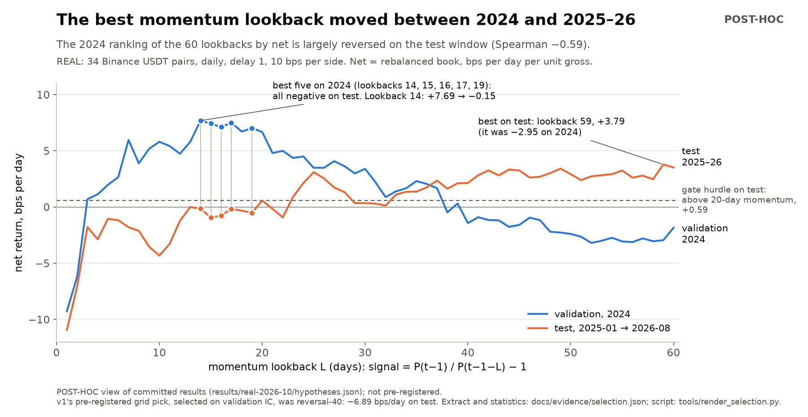
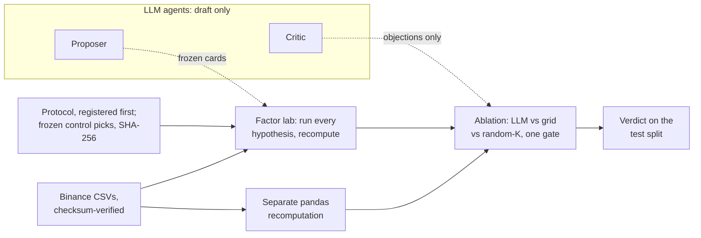

# asof-research: can an LLM pick better trading hypotheses than brute force?

[](https://github.com/oscar-chw/asof-research/actions/workflows/ci.yml) [](https://github.com/oscar-chw/asof-research/actions/workflows/lint.yml)

**120 trading hypotheses screened on real Binance data; the pre-registered gate blocked both control picks, which lost money out of sample**
(34 pairs; selected on 2024, tested 2025-01 → 2026-08; 10 bps a side: −6.89 and −7.38 bps/day, [ablation.json](results/real-2026-10/ablation.json)).
asof-research is the point-in-time ("as-of") harness behind that run. It tests an LLM without trusting it:
every hypothesis is frozen before it is scored, every number is computed by code the model never touches,
and the LLM must beat two dumb controls under the same gate: enumerate all 120 hypotheses, or draw 8 at random.
The LLM arm is pending; it is scored on a forward window that closes 2027-08-31 ([protocol v2](results/forward-2026-09/README.md)).


<sub>The best lookback moved from short to long: the 2024 ranking of the 60 momentum lookbacks by net is largely reversed on the test window (Spearman −0.59).
A POST-HOC view of the committed results, not pre-registered ([selection.json](docs/evidence/selection.json)).</sub>

```sh
python3.11 -m venv .venv && .venv/bin/pip install -r requirements.txt
bash scripts/demo.sh                        # offline, a few seconds: the loop, then the real-data table
python3 tools/render_selection.py --check   # recompute the figure's numbers from the committed results
```

The demo walks five hand-written hypotheses to [four different deaths](docs/how-a-hypothesis-dies.md).
Reading paths for researchers, developers and LLM-safety reviewers are in the [docs index](docs/README.md).

Implemented with AI coding agents under Oscar's design and review.

## The problem

An LLM can write a plausible trading hypothesis and explain away any backtest. Its
output is worthless unless something outside the model controls
**what data the test could see**, **when the rule was fixed** and **who may write
numbers**. A fourth question is usually skipped: **does the LLM beat a dumb search?**
If enumerating every hypothesis, or drawing a few at random, selects as well, the LLM
adds cost and no evidence. Here code checks the first three where it can, and the
fourth is an experiment with frozen controls.

## Approach

**The research loop** ([loop.py](apps/quantos/src/quantos_showcase/loop.py)):

| Stage | What happens | The LLM can |
|---|---|---|
| propose | K hypotheses from retrieved vault notes, recorded before any price exists | draft; it never sees prices |
| validate | Drop bad schema, unretrieved citations, duplicates | nothing |
| freeze | A [method card](packages/vault/method_contract.py) fixes signal, lookback, cost, splits and rule, hashed with the data | nothing |
| test | The [factor lab](packages/factor/README.md) runs and recomputes on the prices **without the test rows**; the rule reads validation | nothing |
| critique | A critic sees validation evidence, through a fixed schema | object; a metric field quarantines it |
| gate | Only a card that passed the rule and the critic gets a **test number**; a human or a pre-registered rule decides | nothing |

**The test** ([evaluator.py](packages/factor/src/factor_research/evaluator.py)) is
delay 1: signal `P(t-1)/P(t-1-L) - 1` (reversal is its negative), entry at the close
of t, unit-gross rank weights. Net is a daily-rebalanced book at 10 bps per side.

**The race** ([ablation.py](apps/quantos/src/quantos_showcase/ablation.py)): every
(signal, lookback) runs once through the factor lab. The three arms choose from the
same scored trials (the LLM's frozen cards, the whole grid, or a seeded random K),
select on validation, and get one look at test.

## Results

Disclosed first ([details](results/real-2026-10/README.md#disclosures)): the author's
alpha-gp-lab repository had already evaluated v1's test window, and v1 gave the LLM a stricter gate
than the controls. Both are why protocol v2 exists.

**Protocol v1, REAL data** ([protocol.json](results/real-2026-10/protocol.json),
registered 2026-10-03 18:10 UTC+08:00, before the first run; SHA-256
`6bc1e31d934c657ede178f86b439f3b894351ce3fb8680f6d7c2e02cf903cb16`. This repository was
published with fresh history, so git order cannot show this; see the
[publication history](docs/design-history.md#publication-history)): 34 Binance USDT pairs, daily, checksummed in
[binance_universe.json](fixtures/binance_universe.json), **survivorship-biased**.
Validation 2024, test 2025-01-01 → 2026-08-31. Grid: momentum or reversal × lookback
1–60. Gate: test net > 0 and above the best baseline.

| arm or baseline | selected on validation IC | validation IC (t; Newey-West t) | test IC (t) | test net bps/day | promoted |
|---|---|---|---|---:|---|
| LLM | not run yet | | | | |
| grid, all 120 | reversal-40 | +0.0297 (2.01; 2.13) | −0.0023 (−0.20) | −6.89 | no |
| random-K, 8 | reversal-48 | +0.0248 (1.63; 1.72) | −0.0030 (−0.26) | −7.38 | no |
| 20-day momentum baseline | fixed | | −0.0062 (−0.56) | +0.59 | |
| 1-day reversal baseline | fixed | | +0.0115 (+1.12) | −15.32 | |
| equal-weight hold baseline | fixed | | n/a | −3.92 | |

Sources: [ablation.json](results/real-2026-10/ablation.json); Newey-West t (lag 5) from
[posthoc.json](results/real-2026-10/posthoc.json), POST-HOC. The LLM arm did not run in v1: the
`claude` CLI was not signed in when v1 ran, and the protocol's failure rule reports the arm as pending.

**What carries the verdict** is the test split: the grid's pick has test t −0.20, and
over 10,000 further random-K draws the pick's test net was positive in 0.12%
([ablation.json](results/real-2026-10/ablation.json)).

**Why selection failed** (the figure, POST-HOC): the five best momentum lookbacks on
2024 net are all negative on test ([selection.json](docs/evidence/selection.json)).

**What the LLM must do to win.** Every hypothesis is already scored, so any 8 cards
land between −15.32 and +3.79 bps/day; 30 of the 113 possible picks pass the gate
([posthoc.json](results/real-2026-10/posthoc.json)). [Protocol v2](results/forward-2026-09/README.md),
amended five times before any LLM call, gives every arm one rule, selects on net, and
has frozen the controls' picks. Its LLM arm is registered against a forward window that closes
2027-08-31, and since amendment 5 it uses an open-weight model, Qwen3.8-27B on OpenRouter, with no
Anthropic or OpenAI model.

**Why believe the numbers.** [crosscheck_real.py](scripts/crosscheck_real.py)
recomputes all 962 reported numbers from the raw CSVs with pandas, without the factor
lab; the largest difference is 8.9e-16 ([study README](results/real-2026-10/README.md)).

## How to run

```sh
bash scripts/demo.sh /tmp/asof-demo     # the loop on SYNTHETIC panels, then the committed v1 table
bash scripts/check.sh                   # every suite (it prints each count), C++ if clang++ exists, the demo
python3 tools/render_selection.py       # redraw the figure (needs matplotlib)
```

With the CSVs from `scripts/fetch_binance_daily.py` (network),
`ASOF_DATA_DIR=<dir> bash scripts/demo.sh` also verifies their checksums and recomputes
every number with a separate pandas script; `scripts/real_run.sh` reruns the study.

## Architecture



Loop stages: [how a hypothesis dies](docs/how-a-hypothesis-dies.md). Every package: [architecture.md](docs/architecture.md).

### Design decisions and trade-offs

- **A critic that cannot promote.** A fixed schema and a signed receipt: it can only object, and a broken critic blocks. Trade-off: false negatives, never false positives.
- **Frozen method cards**, hashed with the data before evaluation. Trade-off: any tweak is a new card and another trial.
- **Test sealed until the gate, in code.** Pre-gate trials run without the test rows, so a card that stops earlier never gets a test number; `verify` refuses a pre-gate trial that saw them ([how this changed](docs/design-history.md)). Trade-off: survivors run twice.
- **Which seal applies where.** The loop seals test until its gate; the race scores all 120 trials on test, but only after every arm's pick is frozen; and in v2 the seal is the frozen selection plus order: bars from 2026-09-01 to 2026-10-03 were public at registration but not fetched here, the frozen grid and random-K picks cannot use them, the rest of the window did not exist yet, and the LLM arm's proposal call is made before this repository fetches any forward bar ([protocol.json](results/forward-2026-09/protocol.json), `splits.test`). This repository's first public push is the timestamp that matters: GitHub records it, independently of the author, so check it on GitHub; whatever follows it, such as the commit of the LLM replays made after that call, can be checked against it ([publication history](docs/design-history.md#publication-history)). The frozen card holds the full prices, so the loop's seal guards the pipeline, not the operator.
- **Replay bound to the prompt hash.** Offline answers; a changed prompt fails loudly. Trade-off: every prompt change re-binds the cache.
- **Point-in-time contracts.** Every price carries `available_at`. Trade-off: declared, not audited.
- **Controls frozen before the LLM runs.** v2's grid and random-K picks are frozen in [selections.json](results/forward-2026-09/selections.json), its SHA-256 computed at publication and equal to the file as registered in the private development history ([publication history](docs/design-history.md#publication-history)). Trade-off: none can adapt later, by design.

### Repository map

Names predate the study; protocol v2 names `quantos_showcase.ablation`, so nothing is renamed before 2027-09.

The research path, readable in an hour:

| Path | Distribution (import) | Owns |
|---|---|---|
| [apps/quantos](apps/quantos/README.md) | `quantos-showcase` (`quantos_showcase`) | The loop ([loop.py](apps/quantos/src/quantos_showcase/loop.py)) and the ablation ([ablation.py](apps/quantos/src/quantos_showcase/ablation.py)) |
| [packages/factor](packages/factor/README.md) | `offline-factor-research` (`factor_research`) | Point-in-time panels, rank IC, costs |
| [packages/vault](packages/vault/README.md) | `quant-paper-store` (flat modules) | Notes, retrieval, method cards |
| [packages/research](packages/research/README.md) | `qrae-rd` (`qrae`) | LLM transport (a replay cache, or a pinned open-weight model on OpenRouter); critic broker (`codex_broker.py`, named for its first backend; it runs through that transport) |

Supporting / separate experiments, not used by the study:
- [packages/marketdata](packages/marketdata/native/README.md) (`quant-marketdata`, `replay`): point-in-time order-book replay and an opt-in C++20 port, ~2.3× from Python (2.30× through `replay.book`, 2.27× calling the module alone; their per-process medians overlap, so the gap is noise) and 25.10× over Python batch when called from C++ (`python_batch_over_cpp_batch`) on a SYNTHETIC workload ([results](packages/marketdata/native/bench/results-2026-10-04.json)).
- [packages/imc-sim](packages/imc-sim/README.md) (`imc4-analysis`): IMC Prosperity 4 post-competition analysis; with the app's quote workflows, see [other experiments](docs/other-experiments.md).

## Limits

- **No model has run the loop.** Every LLM response here is hand-written; the live path is tested only with fakes.
- **One market, one used window, a biased universe**: 34 surviving Binance pairs over 20 months that another analysis had already seen.
- **Idealized execution**: trades at the daily close, a flat 10 bps, fractional positions, and no slippage, borrow or funding.
- **A narrow space**: momentum or reversal with a lookback; five hand-written notes; retrieval unevaluated.
- **Low power, stated in advance**: in v2 one arm breaks even at about 8.7 bps/day of test net, with about a 15% chance of detecting the frozen grid pick's own validation edge, 3.21 bps/day ([power.json](results/forward-2026-09/power.json)).

## What I learned

Lessons from what the repository records (confirmed by the author, 2026-10-03).

- **A validation winner among 120 related tries can vanish out of sample.** The
  grid's pick had validation t = 2.01 (Newey-West 2.13) and test t = −0.20. Source:
  [ablation.json](results/real-2026-10/ablation.json), [posthoc.json](results/real-2026-10/posthoc.json).
- **The selection metric and the gate metric can disagree.** 36 of 60 momentum
  lookbacks had negative validation IC and positive validation net, in one
  window. Source: [posthoc.json](results/real-2026-10/posthoc.json).
- **A gate can decide an experiment before it runs.** No hypothesis clears the
  sleeve-cost card rule, so v1's LLM arm could not win. Source:
  [the study README](results/real-2026-10/README.md#disclosures).
- **An LLM transport must carry the whole contract.** The critic's output schema
  reached Codex as a file argument but never reached `claude -p`, the live transport then. Source:
  [llm.py](packages/research/src/qrae/llm.py), [test_llm.py](packages/research/tests/test_llm.py).
- **Correctness, statistical evidence and economic utility are separate gates.**
  Source: [engineering-case-study.md](docs/engineering-case-study.md), recorded lesson.

---

The git history is short because this repository was published with fresh history, and the
development history is private; the [design history](docs/design-history.md#publication-history) says why,
and what evidences the pre-registration instead. The envelope
validator, which refuses an overclaiming run summary, comes from my
[codex-quant-os](https://github.com/Oscar-Codespace/codex-quant-os) (archived). My other real-data
result, a negative walk-forward, is [Polymarket-Crypto-5min](https://github.com/oscar-chw/Polymarket-Crypto-5min). MIT licensed.
