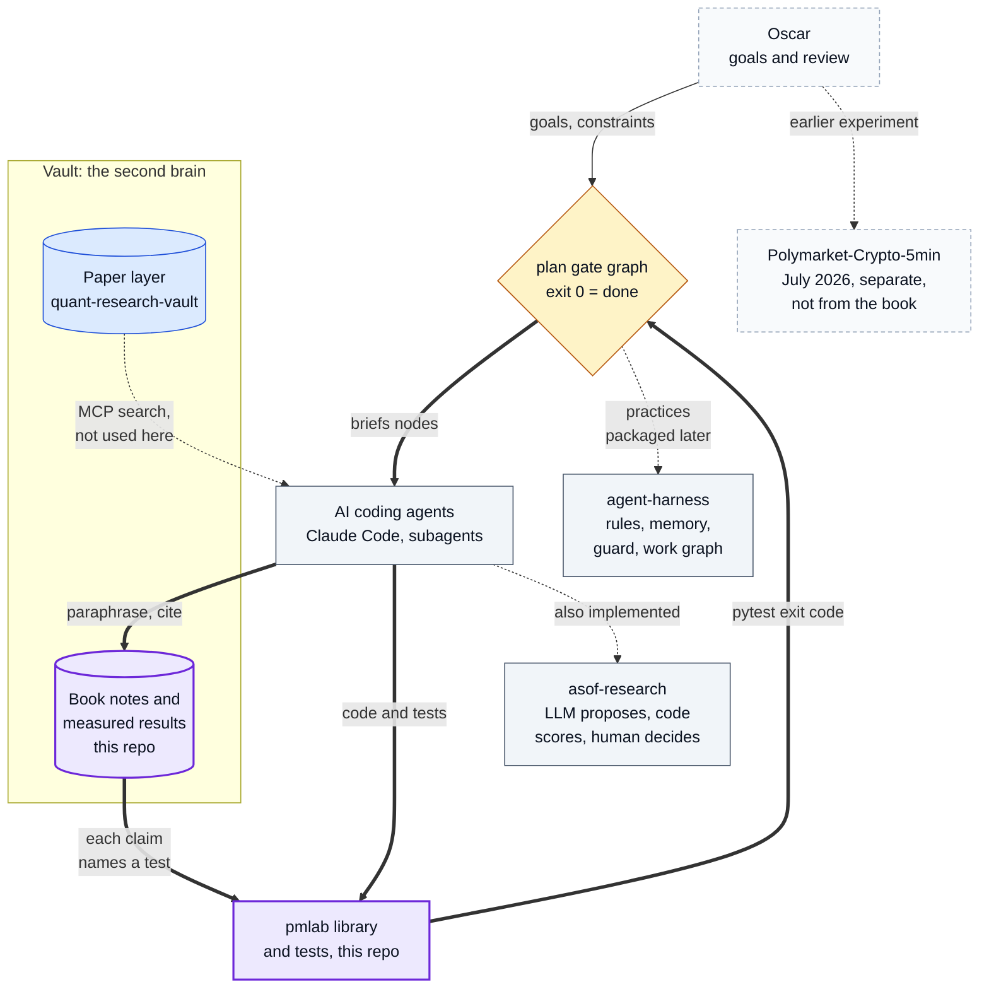
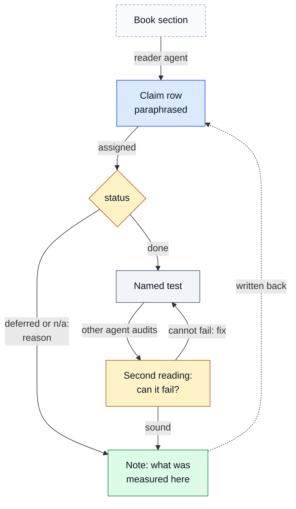

# AI Quant Research System: From a Textbook to a Tested Library with Gated Agents

[](https://github.com/oscar-chw/agentic-quant-research/actions/workflows/ci.yml) [](https://github.com/oscar-chw/agentic-quant-research/actions/workflows/lint.yml) [](https://github.com/oscar-chw/agentic-quant-research/actions/workflows/platform.yml) [](https://github.com/oscar-chw/agentic-quant-research/actions/workflows/platform-lint.yml)

This is the front page of Oscar's AI quant research system: a vault that keeps book notes and measured results as
cited, version-controlled notes, a harness whose gates decide when work is done, and AI coding agents that read,
build and review. Its centrepiece is one complete build: over about four days in September 2026, a Claude Code
orchestrator and its subagents turned López de Prado's *Advances in Financial Machine Learning* into 1,805
paraphrased, cited claims and a tested Python library. The result in this repository: 1,417 of 1,615 implemented claims
verified by passing tests (773 tests, 0 failing). Across the whole project, the orchestrator and about 140 AI
subagents (per private session logs) completed 266 gated tasks.

How the parts connect (purple marks this repository; every other named repository is a separate component):



Where in the code: `docs/claims/` (book notes), `plan/` (the gate graph), `src/pmlab/afml/` and `tests/` (library);
[docs/system.md](docs/system.md) explains how the parts work. The build ran as local sessions that are no longer
running; this repository is its record, the library and the tests.

## Components of the system

Each row is a separate repository; its role and numbers are taken from that repository's README.

| Component | Repo | Role in the system | Key evidence |
|---|---|---|---|
| Book-to-library build (centrepiece) | this repo | The vault's book and results notes, and the library built from them under the gate graph | 1,417 of 1,805 claims have every named test passing; 773 tests pass, 0 fail ([evidence](docs/evidence.md#a-claims)) |
| Vault, paper layer | [quant-research-vault](https://github.com/oscar-chw/quant-research-vault) | arXiv and OpenAlex metadata into SQLite, indexed in ChromaDB, searched read-only over MCP; not used in this build | 5 offline tests pass; 18,492 paper rows in its local, unpublished database at a 2026-07-30 audit |
| Research harness | [asof-research](https://github.com/oscar-chw/asof-research) | Point-in-time harness: an LLM proposes hypotheses but never scores them; a pre-registered gate, then a human or a pre-registered rule decides. Also holds the factor lab and an order-book replay package | REAL Binance data, 34 pairs: the gate blocked both control picks, which lost 6.9 and 7.4 bps/day out of sample; the LLM arm is pending until 2027-08-31 |
| Agent harness | [agent-harness](https://github.com/oscar-chw/agent-harness) | The rules, memory, command guard and gated work graph, packaged as one install for AI coding tools | Held-out guard set: the v0.2 guard blocked 39 of 45 dangerous commands and allowed 20 of 20 safe ones; 836 tests pass (v0.3.2) |
| Earlier experiment | [Polymarket-Crypto-5min](https://github.com/oscar-chw/Polymarket-Crypto-5min) | July 2026, separate, not built from the book: a point-in-time walk-forward backtester for Polymarket's Bitcoin 5-minute markets | Found and fixed a look-ahead leak; the corrected selected result is negative (−$12.31 on $160 staked, 16 trades) |

## Why this exists

A methods book is where quant research goes wrong quietly. A method gets implemented half-way, a leak goes untested,
a backtest gets tuned until it looks good. AFML spends 22 chapters on exactly these failures. The question here was
whether AI coding agents, held to machine-checked gates, could carry a whole book into code so that every claim it
makes can be traced to a test that would fail if the code got it wrong.

## Approach

1. **Read and paraphrase.** Reader agents went through the book heading by heading. Each claim became one row: our
   own words, the section number, its kind (logic, math, structure, algorithm, pitfall, constraint) and a status.
2. **Plan with gates.** Each piece of work was a node in `plan/<slug>.md` with a gate, a command whose exit code is
   the only definition of done. A failed gate appends evidence and returns the node to pending: there is no failed
   state ([the rules](docs/harness-rules.md)).
3. **Build with tests.** Builder agents wrote the library and, for each "done" claim, a named test: the book's worked
   example, a closed form, or a simulation with a known answer.
4. **Read it again.** A second agent that had not written a chapter re-read it, counted its claims, and opened every
   test to ask whether it could fail. 165 of 276 headings needed a fix.
5. **Write results back.** What a test or study measured on this market is recorded in the claim's note, including
   where the book's advice did not pay here.

How one claim moves through that loop:



Where in the code: `docs/claims/chNN.md`, `docs/claims/audit/chNN.md`, `scripts/claims.py`. The library covers
information-driven bars, the triple barrier and meta-labelling, sample uniqueness, fractional differencing, purged
and combinatorial purged cross-validation, the probability of backtest overfitting, the deflated Sharpe ratio,
hierarchical risk parity, structural breaks, entropy and microstructure features such as VPIN
([module map](docs/library.md)). More diagrams: [docs/DIAGRAMS.md](docs/DIAGRAMS.md).

## Results

| Measure | Result | Evidence |
|---|---|---|
| Claims written | 1,805 across 22 chapters: 1,615 done, 31 deferred, 159 not applicable | [evidence (a)](docs/evidence.md#a-claims) |
| Claims whose every named test passes here | 1,417 of 1,805 (of the 1,615 done: 1,417 pass, 32 partly run, 34 reference only, 132 not in repo, 0 failing) | [evidence (a)](docs/evidence.md#a-claims) |
| Tests in a fresh environment | 773 passed, 15 skipped (xgboost absent), 23 deselected (inputs not published), 0 failed | [evidence (a)](docs/evidence.md#a-claims) |
| Second reading by a different agent | 165 of 276 headings fixed, 111 right as written | [claims README](docs/claims/README.md#the-second-reading) |
| Gated work graph, whole project | 266 gated tasks done of 285 nodes; 13 of 399 gate runs failed and sent their node back (book plans: 72 of 73, 5 of 116) | [evidence (b)](docs/evidence.md#b-orchestration) |
| Subagents, whole project | about 140 AI subagents (per private session logs); approximate, not reproducible here | [evidence (b)](docs/evidence.md#b-orchestration) |
| Copy check against the book | longest shared run 14 words (formula symbols); limit 15 | [evidence](docs/evidence.md#copyright-the-copy-check) |
| Leakage demo, SYNTHETIC | irrelevant feature: 0.73 accuracy under shuffled k-fold, 0.49 under purged k-fold | [scripts/demo.py](scripts/demo.py) |

No trading result is claimed: the build's Polymarket studies are not published here.

## Quick start

```bash
python3.11 -m venv .venv && .venv/bin/pip install -r requirements.txt
bash scripts/demo.sh        # SYNTHETIC: leakage, selection bias, memory; ends with six "ok" lines (seconds)
bash scripts/check.sh       # tests, claim ledger, plan statistics, demo; about 4 minutes
.venv/bin/python scripts/claims.py        # 1,805 claims by status, and the second reading's tally
.venv/bin/python scripts/plan_stats.py    # the plan graph: 285 gated nodes, 266 done (73 and 72 for the book)
python3 scripts/copy_check.py --book <your copy of AFML>.txt   # the 16-word copy check
```

## Project structure

```
src/pmlab/afml/   one module per AFML chapter or method
src/pmlab/        bars, labels, metrics and the research modules the library imports
tests/            the published tests; unpublished.txt names the deselected ones and why
docs/claims/      the book as 1,805 paraphrased claims, and the second reading
plan/             sanitized copy of the build's 18 plan graphs
scripts/          check, demo, claim ledger, plan statistics, copy check, plan export
```

Docs: see [docs/README.md](docs/README.md).

### Design decisions and trade-offs

- **Claims as Markdown tables in git, not a notes app.** Agents read them with the same tools as code, and a script
  checks them. The cost: no backlinks or graph view.
- **Exit code as the only definition of done.** A report of success counts for nothing until its gate passes. The
  cost: a weak gate passes too, which is why the second reading exists.
- **A different agent audits each chapter.** The cost was large, 165 headings reworked, but it found tests that
  could not fail.
- **Deselect by name rather than delete.** Tests whose inputs stay private are listed with the reason, and their
  claims count as "reference only", never as passing; a claim that cites a test file absent from this repo is counted as "not in repo". The cost: 198 done claims are not fully checked here.
- **Paraphrase, and refer to equations by section.** The notes stay legal to publish; the cost is that a reader needs
  the book to see the exact equations.

## Limits

- Not a running service. The live paper-trading engine, the dashboard and the execution layer stayed private, and the
  system was shut down on 30 September 2026. Claim notes and plan nodes that mention an always-on engine or a
  confirmation analysis on 2026-10-24 were written while it ran; that analysis will not take place.
- Built for one market, Polymarket's BTC 5-minute Up/Down tokens: some modules assume 300-second windows and binary
  payoffs held to expiry.
- 198 of 1,615 done claims are not fully checked here, because their tests or inputs are private
  ([why](docs/evidence.md#a-claims)).
- Subagent counts come from private session logs, are approximate and cover the whole project, not only the book.
- The claims were audited by agents, not by an outside expert in the book.
- The paper layer of the vault was not used in this build.

## Lessons

Each lesson is a conclusion the build's own records state.

1. **A passing test is not evidence until it can fail.** The second reading fixed 165 of 276 headings; in chapter 6
   one test would still pass with the boosting reweighting reversed ([audit/ch06](docs/claims/audit/ch06.md)).
2. **Put a method's discipline into the machinery.** "Research before backtest" is a test that reads the plan graph
   ([test_afml_backtest_discipline.py](tests/test_afml_backtest_discipline.py)), so it cannot be skipped by accident.
3. **An exit code beats a report.** 13 of 399 recorded gate runs across the project (5 of 116 in the book plans)
   failed and sent their node back to pending ([evidence (b)](docs/evidence.md#b-orchestration)).
4. **A freeze is not a reason to leave a claim untested.** It forbids changing code, not testing it
   ([audit/ch03](docs/claims/audit/ch03.md)).
5. **Record where the book does not pay, with the number.** The sequential bootstrap raised sample uniqueness only
   from 0.205 to 0.212 here, so it was left out ([claims/ch07](docs/claims/ch07.md), I7.25).

## Credits and licence

Built from Marcos López de Prado, *Advances in Financial Machine Learning* (Wiley, 2018), which is cited by chapter
and section and not reproduced. The other components are listed in
[Components of the system](#components-of-the-system). Code licence: MIT ([LICENSE](LICENSE)).

Implemented with AI coding agents under Oscar's design and review.
