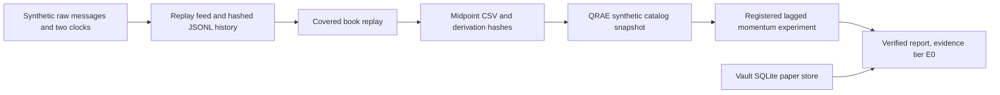

> Package reference. Start at the [root README](../../README.md); the [docs index](../../docs/README.md) has reading paths.

# apps/quantos: the research loop, the ablation and the connected workflows

The research loop (`quantos-loop`, [loop.py](src/quantos_showcase/loop.py)) and the LLM-vs-grid-vs-random ablation ([ablation.py](src/quantos_showcase/ablation.py)) are described in the [root README](../../README.md) and [how a hypothesis dies](../../docs/how-a-hypothesis-dies.md). This page covers the other workflows.

Inspect a price experiment from its archived source messages through coverage-aware book replay, costs, validation and eligible reading notes. This offline application connects three maintained components through installed packages: the replay feed's recorded history becomes QRAE input, and the research vault supplies a source citation to the resulting review report.



## Native strategy execution

`quantos-execution` runs the inventory-aware quote study from `packages/imc-sim` (version 0.4.0) from a fixed scenario and source-linked request. It preserves native policy, orders, cancellation, fills and accounting, with complete trace/report navigation. The [finite execution workflow](docs/execution-workflow.md) keeps immutable new-attempt semantics. The separate [persisted workflow](docs/persisted-execution.md) freezes source context and resumes only committed remaining work, with explicit computation, native publication and wrapper completion boundaries.

## Availability-aware quote features

The `quantos-quotes` workflow consumes top-of-book CSV observations with separate event, receipt and availability clocks. It materializes reusable spread/imbalance/weighted-midpoint features and consumes them in a fixed forecast experiment. Delays, revisions, stale data and split boundaries are explicit. The [workflow guide](docs/quote-workflow.md) provides the command, architecture, hand-calculated negative result and limits. Existing `quantos-demo` remains the strict synthetic price/cost path described below.

## Archived feed into feature research

`quantos-feed` connects raw message archives to the shared feature store and forecast evaluator. It preserves availability, invalidates books across gaps, requires a fresh snapshot and excludes pairs crossing a discontinuity, including breaks between decision times. The [feed workflow guide](docs/feed-workflow.md) covers the versioned input, installed commands, persisted legacy-demo bridge and resource limits. Collector order is explicitly distinct from exchange sequence.

## Cross-project research review

`quantos-index` connects this application's feed and execution results to native IMC 4 and factor-lab results through installed adapters. It replays the supported numerical contracts, preserves units and failures, and links reports to their checked sources and method implementations. Follow the [run index guide](docs/run-index.md) for a complete example and explicit verification limits.

## Run from the monorepo

Python 3.11+. From the repository root:

```bash
make deps      # the pinned test/demo dependencies from requirements.txt
make install   # offline editable install of all six packages, no dependency resolution
quantos-demo --output ./artifacts/connected-example
```

Without installing, `source scripts/env.sh` and run `$PY -m quantos_showcase.pipeline --output ./artifacts/connected-example`. The app declares `quant-marketdata==0.5.0`, `qrae-rd==0.16.0`, `quant-paper-store==0.4.0` and `offline-factor-research==0.4.0`; its optional `portfolio` extra pins `imc4-analysis==0.4.0`. All five are packages of this repository. There are no absolute private workspace paths in this workflow.

Demonstrated result: 80 synthetic quote observations produce 75 independently reference-checked holdings and a locked-test net return of **−3.3255%**. The report remains `HUMAN_REVIEW / REVISE / E0` (E0 is the lowest evidence tier: software behaviour only, no empirical claim), showing costs, timing, exact source hashes and eligible/excluded reading-note context. Price derivation uses `replay.book.reconstruct_many`, the multi-query replay API.

Use a new output directory. `make deps` downloads ordinary dependencies; `make install` and running `quantos-demo` itself are offline and call no model, exchange, or source provider. On Windows use the virtual environment's `Scripts` executables; Windows execution remains untested.

The application imports `replay` (from `quant-marketdata`), `qrae`, `paper_store` and `source_access` normally. It has no `sys.path` injection, copied strategy/metadata library or editable-install requirement. Each library owns its dependencies; the lightweight paper store and the replay module need only Python's standard library.

## What is real in the demonstration

| Stage | Actual work | Quant purpose |
|---|---|---|
| Raw input | 80 deterministic messages, with explicit source event and receipt times | Make timing assumptions inspectable; do not infer knowledge time from a file date |
| History | `replay.feed` turns each message into keyframe and delta rows; one coverage row spans the batch; all are written as hashed JSONL parts | Keep the instrument explicit and distinguish known data from collection gaps |
| Price adapter | Read the hashed JSONL parts, batch-replay covered books and calculate `(best bid + best ask)/2` | Demonstrate the data-to-research boundary using an explicit price meaning |
| Research admission | Versioned `LOCAL_SYNTHETIC` contract, content-addressed URN, derivation manifest and observed import time | Freeze origin and data identity without pretending to have downloaded real prices |
| Experiment | Existing QRAE `PRICE_BASELINE`, lagged momentum, chronological split and linear turnover costs | Reproduce a registered hypothesis and its accounting under explicit assumptions |
| Verification | Same-input manifest replay, rational price-to-position validation and portable bundle verification | Let a reviewer trace claims back to exact inputs after the source catalog is removed |
| Literature | SQLite deduplicates a public citation; shared source checks admit its digest-matched local reading note and exclude three controlled ineligible fixtures | Keep methodological context with a result; this does not automate paper understanding |
| Diagnostics | Spread and top-level imbalance exported alongside prices | Explain quote conditions and support later inspection; these are not consumed model features |

The literature record references [R&D-Agent-Quant](https://arxiv.org/abs/2505.15155v2). Its stored reading note is our paraphrase of the research/development feedback workflow. The experiment does not reproduce that paper's factor/model search, results, or claimed improvements. No paper body or embedding model is downloaded.

## Review the output

`REPORT.md` shows the negative locked test result, split boundaries, entry/liquidation costs, source and import clocks, and eligible/excluded note context with working source links. `review.json` is the versioned current-run export: it binds those claims to the exact run manifest, artifact digests and local note digests. Both are emitted only after fresh kernel verification and source checks; changed required notes, raw data or results prevent a new report. Re-export with `quantos_showcase.review.export_review(output, destination=output / "recheck")` to a new subdirectory to check freshness again. `summary.json` records package versions, snapshot identity, the verified run manifest and evidence limits. `workspace/collector/` contains the original synthetic messages and the hashed JSONL history. `research/` contains the frozen experiment artifacts.

The first two midpoint observations are hand-checkable: **0.471 and 0.4715**, with spread **0.002**. Twelve application tests check these values, input sensitivity, repeatability, raw tampering, delayed/unknown inputs, coverage gaps, missing post-reconnect bases, package integration, portable verification output preservation, report/export agreement, working links, source exclusions and refusal of changed evidence.

## Design decisions and remaining work

The adapter is deliberately bounded to 30–512 observations and one instrument. Its demonstrated fixture has zero latency: event time, receipt time and decision time are equal. Delayed data is rejected. A general adapter needs separate source, receipt, availability and decision clocks plus as-of joins; simply copying timestamps would leak information.

The shared reconstruction API enforces a fresh baseline in the current coverage epoch, including for direct library callers; the application delegates this rule to the library. The application calls `reconstruct_many` once for the requested times. The library preflights coverage, sorts queries internally, sweeps deltas and returns independent books in original query order. Each call includes input preparation and all output copies; coverage scans remain per query and memory includes all requested output levels. The scalar reference remains available unchanged. Query-path measurements on fixed histories do not qualify live ingestion or market throughput. The demo writes one batch into a fresh directory; it is not an ingestion service.

Midpoints are quote statistics, not fills. The kernel's linear cost model omits spread crossing, queue position, latency, market impact and venue order constraints. Spread/imbalance diagnostics are present to expose context, not to disguise these omissions. E0 and `HUMAN_REVIEW` remain the ceiling, including when numerical returns are positive.

The kernel checks the registered baseline against an independently parsed rational price-to-position oracle, including split entry and liquidation costs. The current-run report/export is implemented. An availability-aware top-of-book contract and a reusable feature store consumed by fixed quote experiments are implemented in `quantos-quotes`. The versioned single-instrument raw-feed adapter is implemented in `quantos-feed`; live capture of its new clocks, general venue conversion and multi-asset/chunked computation remain separate work. Native cross-package result navigation is implemented in `quantos-index`. Autonomous search, cross-market strategy integration and live trading remain separate work.

## Source-backed method requests

Use [the method workflow](docs/method-workflow.md) to freeze a source-linked
hypothesis and comparison rule before running the native quote evaluator.
The shipped example retains its unfavorable result and links to frozen notes,
inputs and the native report. This is one installed integration toward bounded
research campaigns; it does not establish market efficacy or untouched data.
