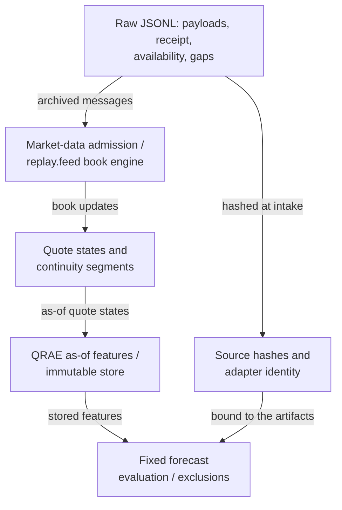

# Archived feed to reproducible research

Researchers need the market state that their system could actually have known
at a decision time. Sorting old deltas by exchange timestamp alone can admit
late data early, reconstruct through an outage, or manufacture a false target.
`quantos-feed` makes those failures visible in the feature and experiment artifacts.



The market-data package owns parsing, aggregate book updates and continuity.
QRAE owns reusable features, exact arithmetic and evaluation. The application
connects their contracts and binds the resulting artifacts. There is no copied
book simulator or second research engine. This implements a data-to-feature-to-
experiment connection within the larger application; it is not its complete agent,
execution or analysis product.

## Run from the monorepo root

After `make install` (see the [application README](../README.md)), or with `$PY -m quantos_showcase.feed` after `source scripts/env.sh`:

```sh
quantos-feed run --archive apps/quantos/examples/feed/archive.jsonl --spec apps/quantos/examples/feed/spec.json --store work/feed-research
quantos-feed verify --store work/feed-research --run-id feed-HASH_FROM_RUN --recompute
```

The response gives the actual run ID and report path. The store contains:

| Directory | Contents and purpose |
|---|---|
| `admissions/runs/feed-…` | Raw archive, requested and bound specs, quote CSV, admission diagnostics, research reference and final hash manifest |
| `features/runs/features-…` | Materialized as-of features, source/spec/code identity and manifest; reused across experiment splits |
| `experiments/runs/experiment-…` | Both fixed forecasts, exact errors, excluded pairs, split summary and human report |

Re-running identical inputs reuses verified results. Changed raw bytes, specs or
code create new identities. Integrity verification checks the complete chain;
`--recompute` additionally replays admission, features and evaluation with the
original code. Hash manifests detect accidental changes; they are not signed
authentication against a hostile writer. An interrupted bundle without its final
manifest is refused and retained. Inspect it and use a new store to recover.

## Input and timing contract

The first JSONL line declares `quant-feed-archive/v1`, one `instrument`, a
`data_kind` (`synthetic` or `user-provided`) and `clock_evidence`
(`PROVIDED_CLOCKS_UNAUDITED`). Subsequent rows contain contiguous `record_id`
values starting at zero, `kind`, `received_ms` and `available_ms`, plus either a
`message` or gap `reason`. The small example shows every field.

Messages use the `book` or `price_change` shape that `replay.feed` reads, explicit
event timestamp strings and the declared instrument. Prices use exact 1/10000
ticks and sizes exact 1/100 shares. A delta replaces aggregate level size;
size zero deletes the level. Unknown types, unknown instruments, malformed sides,
duplicate JSON keys, duplicate snapshot levels and off-grid values refuse the
whole input. Split multi-asset source streams through a separately specified
adapter before using this single-asset boundary.

Receipt and availability must be nondecreasing in the archive and satisfy
event ≤ receipt ≤ availability. This assumes supplied clocks share an aligned
time basis. Collector record IDs describe recorded processing order; they are
**not exchange sequence numbers**. QRAE's new `quote-spec/v2` declares that
meaning and binds the archive/adapter hashes. Its `quote-spec/v1` venue-sequence
and revision semantics are unchanged.

| Condition | Feature/evaluation behavior |
|---|---|
| Update received but not yet available | Use earlier eligible state; never expose the update early |
| No initial snapshot | `AWAITING_SNAPSHOT` |
| Declared disconnect/resubscription/end/operator gap | `GAP`; clear state and require a new full snapshot |
| Older event timestamp than admitted history | `OUT_OF_ORDER`; clear state and require a new full snapshot |
| Recovery snapshot predates gap-detection receipt time | Refuse it as a usable baseline under the conservative aligned-clock rule |
| Full snapshot disagrees with reconstructed state | Adopt it at availability; record disagreement and a new continuity segment |
| Missing side or crossed book | Explicit unavailable state; no invented prices |
| Known break wholly between two decision times | Exclude the pair even if both endpoint quotes are valid |
| Quote too old on the declared grid | `STALE`; count the exclusion |

Same-event-time message order follows the archive; there is no venue ordering
proof or retrospective correction reconstruction. Gap records are effective at
their availability time. This cannot detect an unrecorded packet loss or know
about a disconnect before the collector did. After the final record, freshness
alone is not proof of connectivity: record an `archive_end` gap at the actual
known end when appropriate. Silent periods are not converted to fabricated ticks.

## Connect the existing archived demo

```sh
quantos-demo --output work/legacy-demo
quantos-feed from-demo --snapshot work/legacy-demo/workspace/collector --archive work/legacy-feed.jsonl
quantos-feed run --archive work/legacy-feed.jsonl --spec apps/quantos/examples/feed/demo-spec.json --store work/legacy-feed-research
```

The bridge checks the persisted raw hash and existing 30–512 observation,
strictly increasing zero-latency synthetic contract. It records the source
raw/snapshot hashes and labels `SYNTHETIC_ZERO_LATENCY`. Availability equals
receipt **only because that synthetic generator explicitly has zero latency**.
No old source file or old price/cost workflow is rewritten. Recorded archives
without receipt/availability evidence are not accepted through this bridge;
capturing those clocks live is not built here.

## Inspectable result and resource limits

The delayed/gapped fixture yields a training weighted-midpoint MAE of 50 ticks
versus 0 for midpoint. Both forecasts are retained. A disconnect at 21 and a
recovery snapshot at 25 exclude the 20→30 pair, despite valid quotes at both
ends. Additional hidden-between-grid breaks and end-of-archive exclusions are
recorded. This is a small hand-checkable negative forecast result, not a profit
or market-quality claim. The supplied clocks remain unaudited and evidence E0.

Admission is bounded to 16 MiB, 100000 records and 10000 current book levels.
Top-of-book extraction scans the current dictionary: O(records × depth), with
bounded in-memory input and quote rows. The shared feature module performs its
availability sweep over the decision grid; source/feature artifacts are immutable.
Large L2 archives need measured streaming/columnar or indexed-book work before
capacity claims. No broker, model provider, cloud service or extra dependency
is used by this offline workflow.
