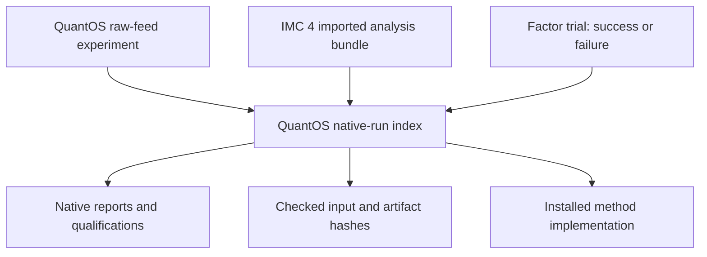

# One place to review native quant workflows

`quantos-index` connects the application's analysis layer to existing results from
QuantOS, IMC 4 analysis and the factor lab. It replays each supported numerical
contract using its owning installed package, then creates a compact JSON/Markdown index with native report, source and method
links. No numerical implementation is copied into the index.

For a quant developer this makes a review practical: follow a suspicious number
back to its input, see its timing/accounting assumptions, inspect the relevant
implementation, and detect when the source or result has changed. A forecast
error in ticks, marked IMC 4 equity and rank IC cannot be ranked on one
performance scale. Each retains its own units.



## Run the three-home example

From the monorepo root, after `make deps install` (see the
[application README](../README.md)):

```sh
python apps/quantos/examples/index/create_index.py --output work/review
quantos-index verify --store work/review/index --index-id three-home
```

Without installing, `source scripts/env.sh` and use `$PY` for `python` and
`$PY -m quantos_showcase.run_index` for `quantos-index`. Open
`work/review/index/runs/three-home/INDEX.md`. The helper invokes the native
implementations with their existing synthetic examples: the QuantOS feed
archive, the IMC 4 community-log import and the factor trend-reversal panel.
All generated outputs stay under the new directory. It also saves a reusable
`selection.json`. It does not rewrite the packages or their examples.

The factor lab is a base dependency of the application; IMC 4 analysis is its
optional `portfolio` extra. Both are packages of this repository; this guide
does not assume they have been published to a package index. The default
QuantOS dependencies remain sufficient for the feed workflow, factor trials and
their index entries. A missing optional package makes its entries
`UNAVAILABLE`, never an implicitly successful empty result. No model provider
or network call is needed at runtime.

## Select your own supported runs

```json
{
  "schema": "quantos-run-selection/v1",
  "entries": [
    {"id": "feed-study", "kind": "quantos-feed", "path": "feed/admissions/runs/feed-YOUR_RUN_ID"},
    {"id": "imc4-run", "kind": "imc4-import", "path": "imc-imported-run"},
    {"id": "factor-study", "kind": "factor-trial", "path": "factor-runs/baseline"}
  ]
}
```

Paths are resolved relative to this selection file; use actual produced run IDs.
Each entry has exactly `id`, `kind` and `path`. Supported kinds are
`quantos-feed`, `quantos-execution`, `quantos-persisted`, `imc4-import` and
`factor-trial`. Select 1–16 runs, including unsuccessful trials relevant to the
research history.

```sh
quantos-index build --selection selection.json --store review-store --index-id review-001
quantos-index verify --store review-store --index-id review-001
```

Existing index IDs are refused. Choose a new ID after changing the selection or
source. Recheck reads source runs and the saved index without rewriting them.
A directory without the final manifest is incomplete; retain it and rebuild to
a new ID. Viewing the Markdown never triggers recomputation.

## What each verification means

| Kind | Reused owner implementation | Supported claim and limits |
|---|---|---|
| `quantos-feed` | `verify_feed` and shared QRAE feature/evaluation workflow | Replay raw source through quote states, features and fixed forecasts. Preserves clock/gap limitations and E0; errors are not returns |
| `imc4-import` | Native importer, analyzer and renderer | Recompute the retained community-format raw/config/normalized bundle, cash/inventory/markouts and view. Require the original installed source identity. Stored runtime metadata is preserved rather than treated as current runtime |
| `factor-trial` | Native `verify_run` and report renderer | Recompute successful numerical and human reports; retain native selection/cost units. Failed trials receive integrity verification only, with their original failure visible |

Plain IMC reports without retained import/source evidence are outside this adapter.

`VERIFIED_INDEX` means every selected entry passed its stated verification scope;
an intact failed factor trial can still appear as `FAILED`. `PARTIAL` means at
least one entry is `REFUSED` or `UNAVAILABLE` and the command exits nonzero. Other
valid entries remain visible. Rechecking a changed source/result/code produces
`STALE` and never refreshes the saved claim silently.

The index binds original selection bytes, normalized paths, its own adapter and
shared validation code, and the exact native files checked. Local links point to
those files; it does not duplicate raw stores. Moving only the index will break
those references. Copying an index does not give permission to publish its sources.
Hash manifests are unsigned and do not authenticate a hostile source owner.

## Resource and architecture boundary

Each entry is capped at 256 files, 16 MiB per file and 128 MiB total. Native
recomputation has its existing dataset limits. Entries are processed
sequentially and only named runs are inspected. Larger data needs a separately
measured verification/snapshot policy rather than hiding a skipped check behind a green status.

This is the implemented cross-package review connection. It provides source-to-code-
to-run navigation; a structured source-to-method knowledge registry, evaluated
retrieval, autonomous campaigns and a richer interactive interface remain future
modules. Development automation is separate from a product research-agent runner.

## Native quote execution

For finite `quantos-execution` attempts, select `STORE/runs/ID`; see [the execution workflow](execution-workflow.md). For persisted execution, use `kind: quantos-persisted` with the wrapper directory `STORE/persisted/runs/ID`. Default verification audits native state without policy replay. Only final wrapper completion becomes a completed entry; paused and incomplete phases retain their exact lifecycle state and make the index partial. Native operational files are excluded from generic evidence traversal. See [the persisted workflow](persisted-execution.md).
