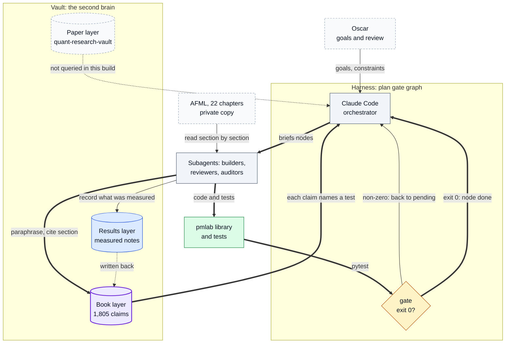
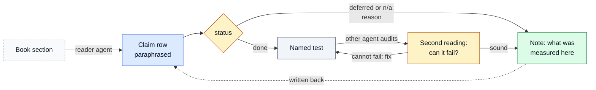
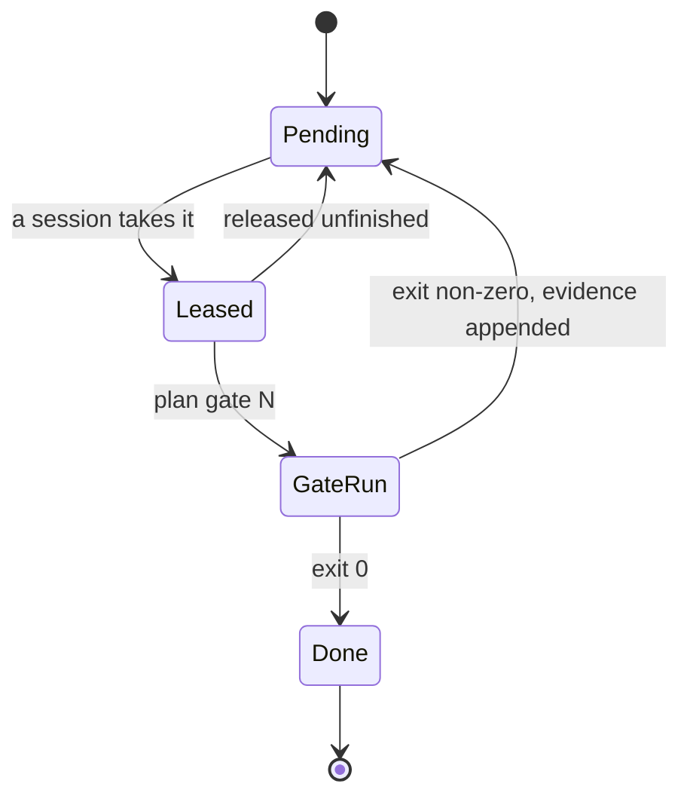
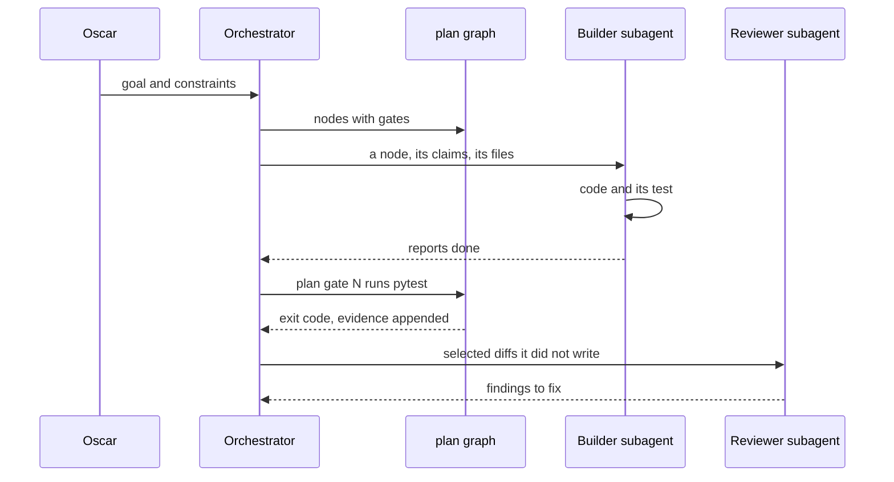
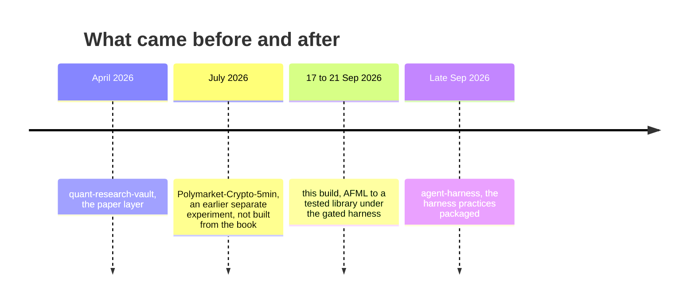

# Diagrams

Numbered index of every diagram in this repository. The README embeds 1 and 2; [system.md](system.md) embeds 2 to 5.
If a diagram and the code disagree, the code wins.

1. [System overview](#1-system-overview)
2. [How one claim moves](#2-how-one-claim-moves)
3. [A node's life in the gate graph](#3-a-nodes-life-in-the-gate-graph)
4. [One node, from goal to gate](#4-one-node-from-goal-to-gate)
5. [Where this build sits](#5-where-this-build-sits)

Colours: blue = stores and inputs, grey = processing, amber = checks, green = results, dashed = external or
private, purple = the path the diagram is about.

## 1. System overview

The three parts and the loop between them: the book goes into the vault as claims, the agents build from the claims under the harness, the gate decides when a node is done, and what the tests and studies measure is written back next to the claims. The paper layer was not queried in this build.

Where in the code: `docs/claims/`, `plan/`, `src/pmlab/afml/`, `tests/`.

## 2. How one claim moves

A claim is paraphrased from a section, gets a status, and if done names a test; a second agent checks the test could fail; what was measured is written back into the claim's note.

Where in the code: `docs/claims/chNN.md`, `docs/claims/audit/chNN.md`, `scripts/claims.py`.

## 3. A node's life in the gate graph

Exit 0 is the only way to done; a failed gate appends evidence and sends the node back to pending, so there is no failed state.

Where in the code: `plan/*.md`, `scripts/plan_stats.py`, `docs/harness-rules.md`.

## 4. One node, from goal to gate

Oscar sets the goal; the orchestrator delegates nodes to subagents (and writes some code itself), runs the gate, and sends selected diffs to a reviewer that did not write them.

Where in the code: private briefs and transcripts; their output is `src/pmlab/afml/`, `tests/` and the gate runs in `plan/*.md`.

## 5. Where this build sits

What came before and after it among Oscar's repositories.

Where in the code: links in [system.md](system.md).
