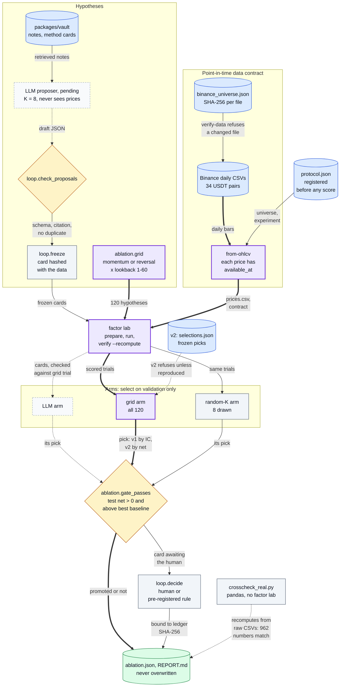
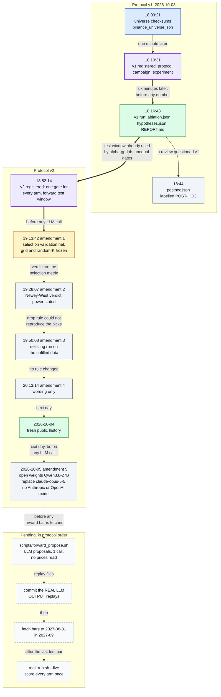
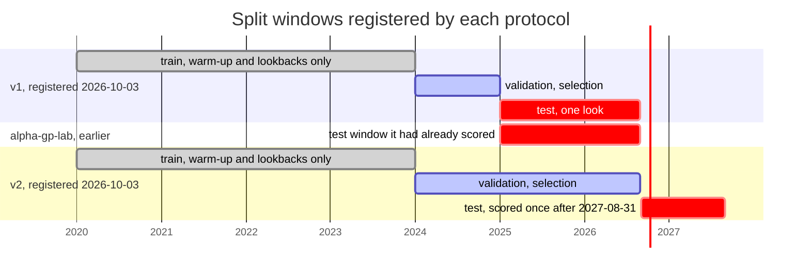
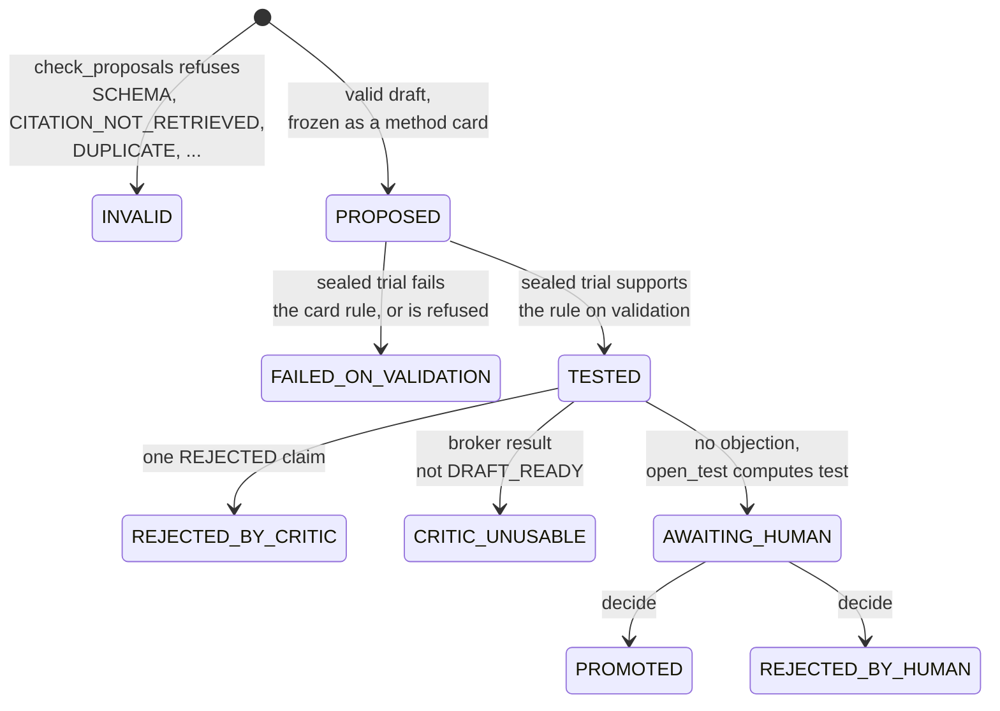
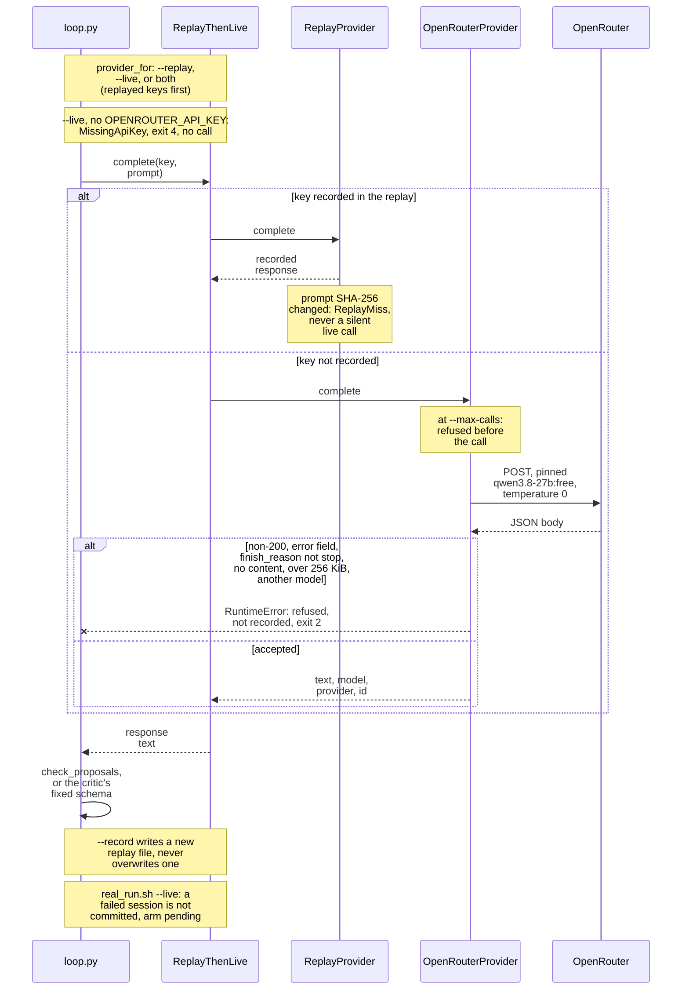
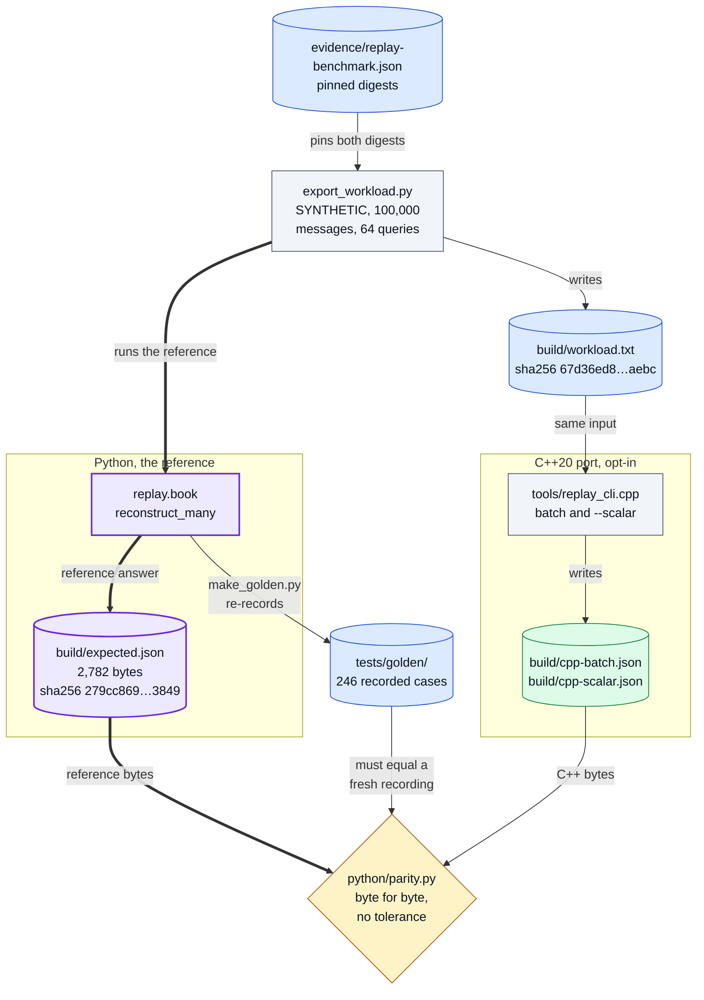
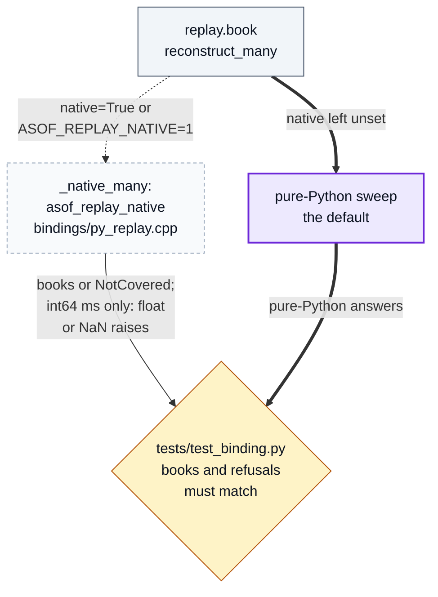
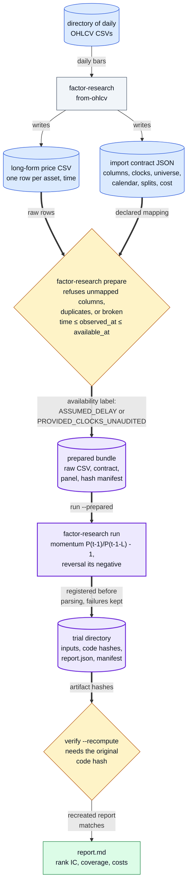
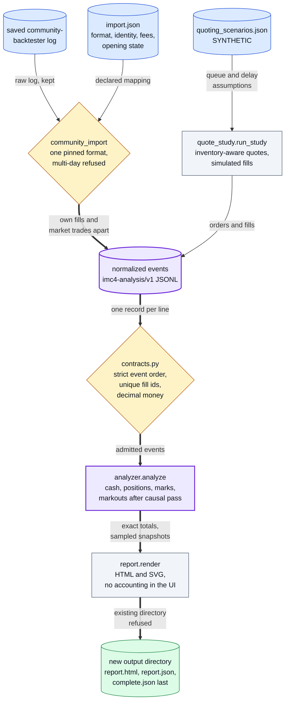

# asof-research in diagrams

The visual companion to the [root README](../README.md). Every box is a module, function, file,
command or registered step in this repository, and every number is one the README or the cited
study files already state. If a diagram and the code disagree, the code wins.

1. System overview: the harness
2. Pre-registration timeline: v1, v2 and its amendments
3. Split windows: v1 against v2
4. A hypothesis in the research loop
5. The LLM transport: replay first, then the pinned live model
6. Order-book replay: the C++ port against the Python path
7. The factor lab package
8. The imc-sim package

Colours: blue = input or store, grey = processing, amber = a check that can refuse,
green = result, dashed = optional, external or pending, purple = the path the study is about.
All times are the author's local time, UTC+08:00, as recorded in [design-history.md](design-history.md).

## 1. System overview: the harness

Prices enter only through a checksummed, point-in-time contract; hypotheses come from the LLM's
frozen method cards or from the enumerate-all grid; every hypothesis is scored by the same factor
lab; each arm selects on validation only, and its pick gets one look at test through a gate fixed
before any run, after which a human or the pre-registered rule decides.

Where in the code: `scripts/fetch_binance_daily.py`, `packages/factor/src/factor_research/{ohlcv,prepare,runs}.py`,
`apps/quantos/src/quantos_showcase/ablation.py` (`verify_data`, `grid`, `select`, `random_arm`, `llm_arm`,
`check_selections`, `gate_passes`, `run`), `apps/quantos/src/quantos_showcase/loop.py` (`check_proposals`,
`freeze`, `decide`), `packages/vault/method_contract.py`, `scripts/crosscheck_real.py`, `scripts/real_run.sh`.

## 2. Pre-registration timeline: v1, v2 and its amendments

The order in which the rules were fixed: v1 was registered six minutes before its run; v2 was
registered after v1's test window turned out to be used, and every amendment came before any LLM
call, any v2 score and any bar after 2026-08-31. The times are the author's record, evidenced by
each registered file's SHA-256 in the [publication history](design-history.md#publication-history),
not by git order. What is left runs in the order the protocol fixes.

Where in the code: [design-history.md](design-history.md) (the dated decisions and the SHA-256 table,
checked by `tests/test_docs.py`), `results/real-2026-10/protocol.json`, `results/forward-2026-09/protocol.json`
(`amendments`), [results/forward-2026-09/README.md](../results/forward-2026-09/README.md) (the pending steps),
`scripts/forward_propose.sh`, `scripts/real_run.sh`.

## 3. Split windows: v1 against v2

The windows each protocol registered. v1's test window, already evaluated by the sibling
repository alpha-gp-lab, becomes part of v2's validation window, and v2's test is a forward year
that did not exist when it was registered.

Where in the code: `results/real-2026-10/protocol.json` and `results/forward-2026-09/protocol.json`
(`splits`, `used_windows`), `results/*/experiment.json` (`splits`).

## 4. A hypothesis in the research loop

Every status a proposed hypothesis can end in. Pre-gate trials run on the frozen prices without
the test rows, so a test number exists only for a card that reaches the human gate; the critic
may only object, and a broken critic blocks.

Where in the code: `apps/quantos/src/quantos_showcase/loop.py` (`check_proposals`, `freeze`, `sealed_prices`,
`test_card`, `passes_validation`, `critique`, `critic_verdict`, `VERDICT_STATUS`, `open_test`, `decide`, `verify`);
walked through on the demo in [how-a-hypothesis-dies.md](how-a-hypothesis-dies.md).

## 5. The LLM transport: replay first, then the pinned live model

How the loop gets an LLM answer. Recorded keys are answered from the replay file and bound to
the prompt's SHA-256; only unrecorded keys reach the pinned open-weight model, within a hard call
budget, and any doubtful answer is refused and never recorded. No model has run the loop yet:
every response in the repository is hand-written.

Where in the code: `packages/research/src/qrae/llm.py` (`ReplayProvider`, `OpenRouterProvider`, `ReplayThenLive`,
`broker_runner`), `apps/quantos/src/quantos_showcase/loop.py` (`provider_for`, `main`), `scripts/forward_propose.sh`,
`scripts/real_run.sh`; the request settings are pre-registered in `results/forward-2026-09/protocol.json` (`arms.llm`).

## 6. Order-book replay: the C++ port against the Python path

A supporting package, not part of the study. The Python module is the reference; the opt-in
C++20 port must write the same bytes on the SYNTHETIC workload before any timing counts, and
from Python it is reached only on request. The edge that differs between the two paths is the
query-time type: the port refuses fractional and NaN times, so pure Python stays the default.

From Python, the port is reached only on request; `tests/test_binding.py` holds both paths to the same answers.

Where in the code: `packages/marketdata/replay/book.py`, `packages/marketdata/native/` (`python/parity.py`,
`python/export_workload.py`, `python/make_golden.py`, `tools/replay_cli.cpp`, `bindings/py_replay.cpp`,
`tests/test_binding.py`, `Makefile` targets `parity` and `pytest`); details and timings in
[native/README.md](../packages/marketdata/native/README.md).

## 7. The factor lab package

`packages/factor`, which computes every number the study uses: prices are refused unless their
clocks and mapping are declared, every run is registered as a hashed trial before it is parsed,
and `verify --recompute` rebuilds the numbers with the original code.

Where in the code: `packages/factor/src/factor_research/` (`ohlcv.py`, `prepare.py`, `evaluator.py`, `runs.py`,
`cli.py`); the study calls `prepare_prices`, `run_trial` and `verify_run` from `loop.py` and `ablation.py`.
Contract and refusal cases: [packages/factor/README.md](../packages/factor/README.md).

## 8. The imc-sim package

`packages/imc-sim`, post-competition tooling for IMC Prosperity 4 and separate from the study:
a saved community-backtester log or a SYNTHETIC quote study becomes normalized events, which one
analyzer turns into cash, inventory and markout diagnostics. It contains none of the team's
competition code, and every example is SYNTHETIC.

Where in the code: `packages/imc-sim/src/imc4_analysis/` (`community_import.py`, `quote_study.py`, `quoting.py`,
`contracts.py`, `analyzer.py`, `report.py`, `cli.py`); details in [packages/imc-sim/README.md](../packages/imc-sim/README.md).
