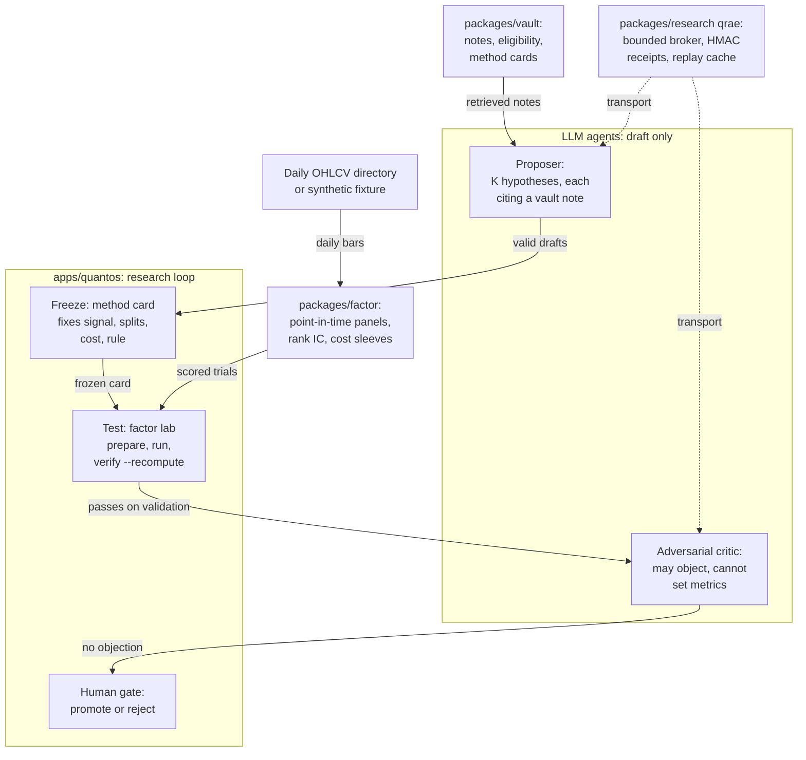
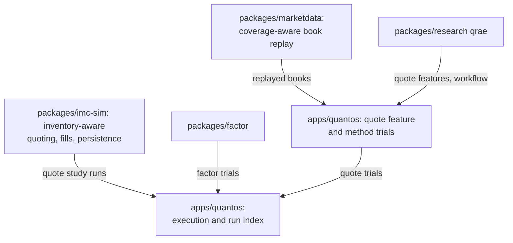

# Architecture: packages, the research loop and what each part owns

The repository is one Python monorepo. Each package owns one kind of
calculation; the `apps/quantos` application composes them and copies no
numerical engine. LLMs sit at the edges of the research loop: they draft
hypotheses and critiques, and deterministic code computes every number that
decides what survives.

The other workflows in `apps/quantos` compose the same packages:

Solid arrows are implemented calls. Dotted arrows mark the LLM transport: a
replay cache by default, or a pinned open-weight model (`qwen/qwen3.8-27b:free`) on OpenRouter when `--live` is passed.

| Package | Owns | Current evidence | Missing |
|---|---|---|---|
| `packages/research` (qrae) | Work orders, point-in-time catalog, chronological price baseline, the bounded critic broker (`codex_broker.py`, named for its first backend; here it runs through the LLM transport), the LLM transport (`llm.py`) | Unit and tamper tests; the broker's schema forbids state transitions and signs results with an HMAC receipt | No recorded live model run |
| `packages/vault` | Note eligibility (`source_access.py`), offline lexical retrieval (`note_index.py`), method cards for quote and factor methods (`method_contract.py`) | Digest-checked notes; cards that fix rules before evaluation | Retrieval quality is not evaluated; the demo vault is five hand-written notes |
| `packages/factor` | CSV import under declared clocks, momentum and reversal features, rank IC, cost-adjusted interval sleeves, OHLCV directory import | Reference checks, missing-data and tamper tests, synthetic positive and regime-switch fixtures; 120 recomputed trials on 34 Binance daily pairs ([results/real-2026-10](../results/real-2026-10/REPORT.md)), matched by a separate pandas recomputation | A survivorship-free universe; a second test period |
| `packages/marketdata` | Point-in-time book replay (`replay/`: scalar and batch reconstruction, a message feed, archived-feed admission); an opt-in C++20 replay port with a pybind11 module (`native/`) | Tests on 246 recorded golden cases and generated histories; a 41.66x batch-over-scalar replay measurement on 100,000 synthetic messages; byte-identical C++ output and Python-side parity tests for the module ([results-2026-10-04.json](../packages/marketdata/native/bench/results-2026-10-04.json)) | Live capture, a storage layer and representative workloads; a Python caller gets ~2.3x, not 25.10x, because the Python side of the call (by subtraction) dominates ([native/README.md](../packages/marketdata/native/README.md)) |
| `packages/imc-sim` | Post-competition IMC Prosperity 4 analysis: inventory-aware quoting, matching, accounting, persisted runs | Synthetic quote studies and recovery tests | Official engine parity; observed inputs |
| `apps/quantos` | The research loop, the LLM-vs-grid-vs-random ablation (`ablation.py`), quote method trials, execution wrapper and run index | End-to-end demo and verify commands; the pre-registered real-data ablation's grid and random arms | The ablation's LLM arm: not run yet (protocol v2 scores it on 2026-09-01 → 2027-08-31) |

## Distributions and import names

Names predate the study; protocol v2 names `quantos_showcase.ablation`, so nothing is renamed before 2027-09.

The research path, readable in an hour:

| Path | Distribution (import) | Owns |
|---|---|---|
| [apps/quantos](../apps/quantos/README.md) | `quantos-showcase` (`quantos_showcase`) | The loop ([loop.py](../apps/quantos/src/quantos_showcase/loop.py)) and the ablation ([ablation.py](../apps/quantos/src/quantos_showcase/ablation.py)) |
| [packages/factor](../packages/factor/README.md) | `offline-factor-research` (`factor_research`) | Point-in-time panels, rank IC, costs |
| [packages/vault](../packages/vault/README.md) | `quant-paper-store` (flat modules) | Notes, retrieval, method cards |
| [packages/research](../packages/research/README.md) | `qrae-rd` (`qrae`) | LLM transport (a replay cache, or a pinned open-weight model on OpenRouter); critic broker (`codex_broker.py`, named for its first backend; it runs through that transport) |

Supporting / separate experiments, not used by the study:
- [packages/marketdata](../packages/marketdata/native/README.md) (`quant-marketdata`, `replay`): point-in-time order-book replay and an opt-in C++20 port, ~2.3× from Python (2.30× through `replay.book`, 2.27× calling the module alone; their per-process medians overlap, so the gap is noise) and 25.10× over Python batch when called from C++ (`python_batch_over_cpp_batch`) on a SYNTHETIC workload ([results](../packages/marketdata/native/bench/results-2026-10-04.json)).
- [packages/imc-sim](../packages/imc-sim/README.md) (`imc4-analysis`): IMC Prosperity 4 post-competition analysis; with the app's quote workflows, see [other experiments](other-experiments.md).

## Design rules

- **Freeze before evaluating.** A method card and its data are hashed and
  committed before the trial runs; `quantos-loop verify` recomputes every trial
  from the frozen card and refuses any drift.
- **The LLM never sees prices.** The proposer sees the campaign question, the
  split dates and retrieved notes. The same drafts therefore face both demo
  panels, and only the deterministic test separates them.
- **Agents have no write path to numbers.** The critic answers through the
  broker's fixed schema (`summary`, `claims`, `artifact_refs`,
  `requested_transition` = `NONE`); a response with any other field is
  quarantined, and the loop fails closed.
- **One owner per calculation.** Applications compose packages; adapters keep
  each package's units and failure states instead of a combined score.
- **Measure before adding machinery.** Processes, columnar engines or native
  kernels belong where a representative workload shows the need and a
  reference result verifies equivalence.
