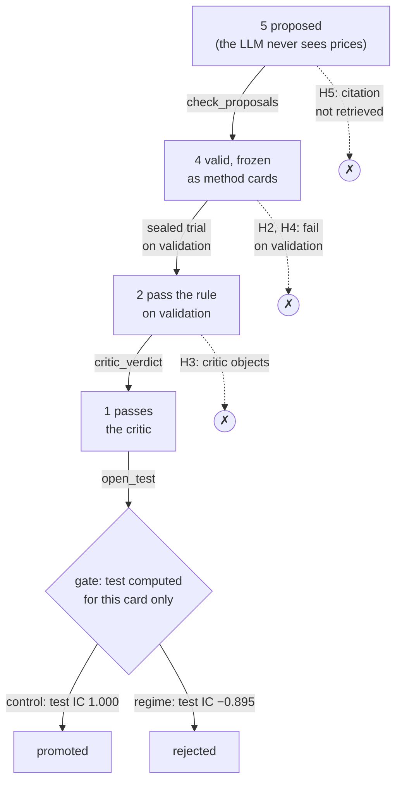
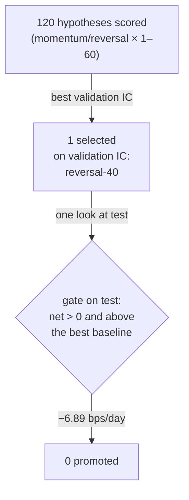

# Five hypotheses, four ways to die

`bash scripts/demo.sh` runs the research loop on two SYNTHETIC 8-asset panels with
a HAND-WRITTEN replay of the LLM ([replay.hand-written.json](../apps/quantos/examples/loop/replay.hand-written.json);
no model wrote it). The same five drafted hypotheses face both panels, and each one
is stopped by a different part of the loop. This page follows them, names the line
of [loop.py](../apps/quantos/src/quantos_showcase/loop.py) that stops each one, and
names the file to open afterwards. The demo prints its output directory; below,
`run/` is `<that directory>/loop/control` (or `loop/regime`).

| H | Card | Dies | Stopped by |
|---|---|---|---|
| H5 | momentum-2, cites Asness–Moskowitz–Pedersen 2013 | invalid | [`reason = "CITATION_NOT_RETRIEVED"`, loop.py:146](../apps/quantos/src/quantos_showcase/loop.py#L146) in [`def check_proposals`, loop.py:126](../apps/quantos/src/quantos_showcase/loop.py#L126) |
| H2 | reversal-1, cites Jegadeesh 1990 | failed on validation | [`def passes_validation`, loop.py:262](../apps/quantos/src/quantos_showcase/loop.py#L262), applied at [`"TESTED" if passed else "FAILED_ON_VALIDATION"`, loop.py:383](../apps/quantos/src/quantos_showcase/loop.py#L383) |
| H4 | reversal-5, cites Lehmann 1990 | failed on validation | the same two lines |
| H3 | momentum-3, cites Moskowitz–Ooi–Pedersen 2012 | rejected by the critic | [`def critic_verdict`, loop.py:299](../apps/quantos/src/quantos_showcase/loop.py#L299), mapped by [`VERDICT_STATUS`, loop.py:55](../apps/quantos/src/quantos_showcase/loop.py#L55) |
| H1 | momentum-1, cites Jegadeesh–Titman 1993 | at the gate, on `regime` only | test computed by [`def open_test`, loop.py:251](../apps/quantos/src/quantos_showcase/loop.py#L251); decided by [`def decide`, loop.py:512](../apps/quantos/src/quantos_showcase/loop.py#L512), called by [`def gate`, loop.py:530](../apps/quantos/src/quantos_showcase/loop.py#L530) |

The counts are asserted in [test_loop.py](../apps/quantos/tests/test_loop.py)
(`test_shipped_hand_written_replay_reproduces_both_campaigns`), and every line
reference on this page is checked by [tests/test_docs.py](../tests/test_docs.py).

## H5: a citation the vault never returned

The proposer only sees notes that retrieval returned from the vault
([apps/quantos/examples/loop/vault](../apps/quantos/examples/loop/vault/jegadeesh-titman-1993.md)
holds five). H5 cites a paper that is not among them, so `check_proposals` marks it
`INVALID` with reason `CITATION_NOT_RETRIEVED` before any card exists. A
plausible-sounding citation is not evidence; the loop accepts only a note it can
hash and freeze next to the card.

Open `run/propose/response.txt` (the raw draft) and `run/ledger.json` (the row with
its reason).

## H2 and H4: the rule, on validation only

The four valid drafts are frozen first: each card fixes signal, lookback, cost,
splits and the comparison rule, hashed with the data, before any trial runs. The
factor lab then prepares, runs and recomputes each trial on the frozen prices with
the test split's rows withheld ([`def sealed_prices`, loop.py:195](../apps/quantos/src/quantos_showcase/loop.py#L195)),
so no test number exists for any card at this stage. The campaign's rule is
mean rank IC ≥ 1/10 and a positive net-of-cost sleeve mean on at least 10 valid
dates ([campaign.json](../apps/quantos/examples/loop/campaign.json)).
`passes_validation` reads the **validation** split alone. The SYNTHETIC panels have
a built-in trend, so both reversal cards score validation IC −1.000 and stop here.

Open `run/cards/runs/H2/card.json` (the frozen rule), `run/trials/H2/report.json`
(the factor lab's numbers, with an empty test split) and `run/outcomes/H2.json` (the
rule's verdict, test `SEALED`). H2 and H4 never get a test number: the gate is the
only place one is computed.

## H3: a critic that may object, and only object

H1 and H3 pass on validation and go to the adversarial critic. The critic sees
validation evidence only: `critic_evidence` leaves the test metrics out
([`def critic_evidence`, loop.py:267](../apps/quantos/src/quantos_showcase/loop.py#L267)). It answers
through a fixed schema with no field for a number, and a reply with any extra field
is quarantined. Here the hand-written critic answer (no model wrote it) says the cited note is about *time-series* momentum (each
asset against its own past), while the card ranks assets *cross-sectionally*, so the
citation does not ground the hypothesis. One `REJECTED` claim is enough:
`critic_verdict` returns `CRITIC_REJECTED`, and the hypothesis stops. A critic that
fails or answers out of schema blocks too (`CRITIC_UNUSABLE`), so a broken critic
can cost a hypothesis but never promote one.

Open `run/critic/evidence/H3.json` (exactly what the critic saw) and
`run/critic/outbox/control/critic-H3.json` with its `.receipt.json` (the answer and
its signed receipt).

## H1: the gate, the only place test is computed

Only H1 reaches the gate, on both panels: they agree on validation, so the filter
and the critic cannot tell them apart. Only now does the loop run H1 on the full
frozen prices, in `run/gate/`, and compute its test metrics; it also checks that this
trial reproduces the sealed validation result. On `control` the trend persists (test
IC 1.000) and the demo's scripted gate promotes H1. On `regime` the trend flips in the test split (test IC −0.895)
and the gate rejects it. `decide` refuses any hypothesis that is not
`AWAITING_HUMAN`, so nothing that failed an earlier stage can be promoted here.

Open `run/REPORT.md` (every hypothesis with its status and reason; test shows as
`sealed` for all but H1), `run/gate/trials/H1/report.json` (the only trial with test
numbers; H1's are also copied into `gate/outcomes/H1.json`, the ledger and the report)
and `run/decisions/H1.json` (the decision, bound to the ledger's SHA-256).
`quantos-loop verify` then rebuilds every status from the frozen cards and trials,
and refuses any drift: a pre-gate trial that saw test rows, anything under `run/gate/`
for a card that never reached the gate, an outcome file that differs from its
recomputed trial, or a `REPORT.md` that is not the rendering of the verified ledger.

## The same shape on real data

The pre-registered Binance study ([results/real-2026-10](../results/real-2026-10/README.md))
has the LLM arm still pending, but the grid arm went through the same kind of
funnel ([ablation.json](../results/real-2026-10/ablation.json)):

POST-HOC, not pre-registered ([selection.json](evidence/selection.json)): 36 of the
120 had positive validation net, 39 positive test net and 17 both. The five best
momentum lookbacks on validation net were all negative on test
([the figure](assets/selection.png)).
