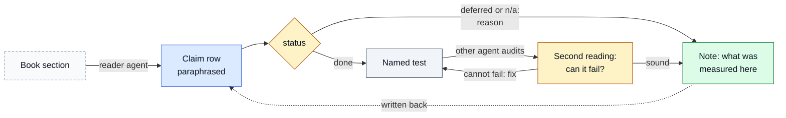
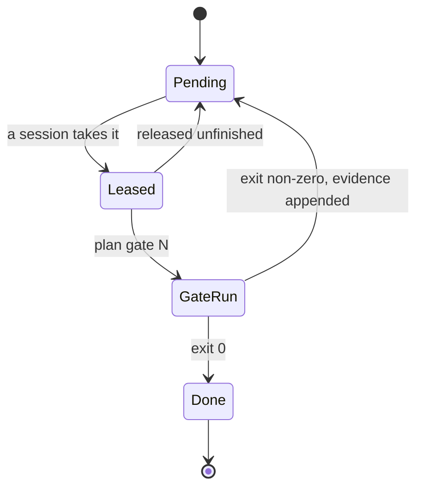
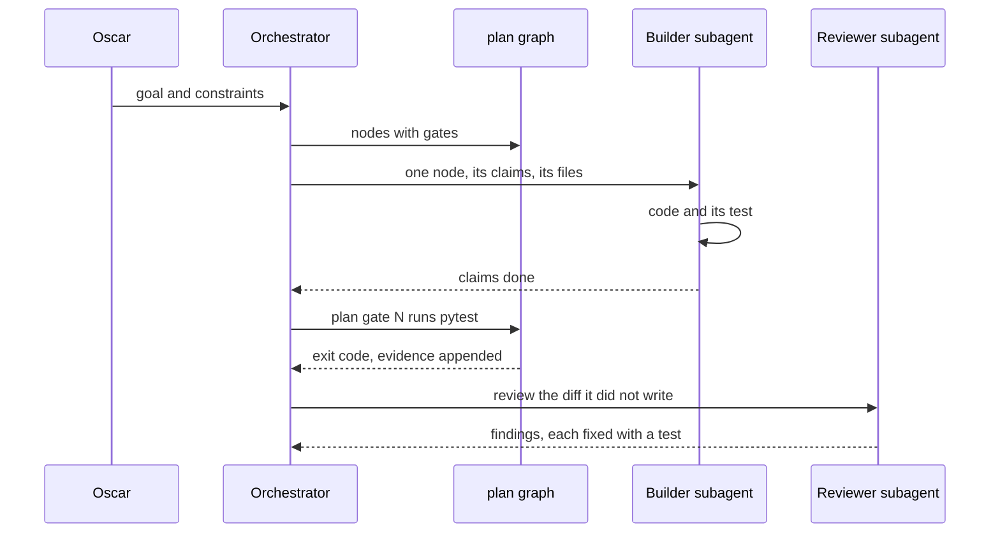
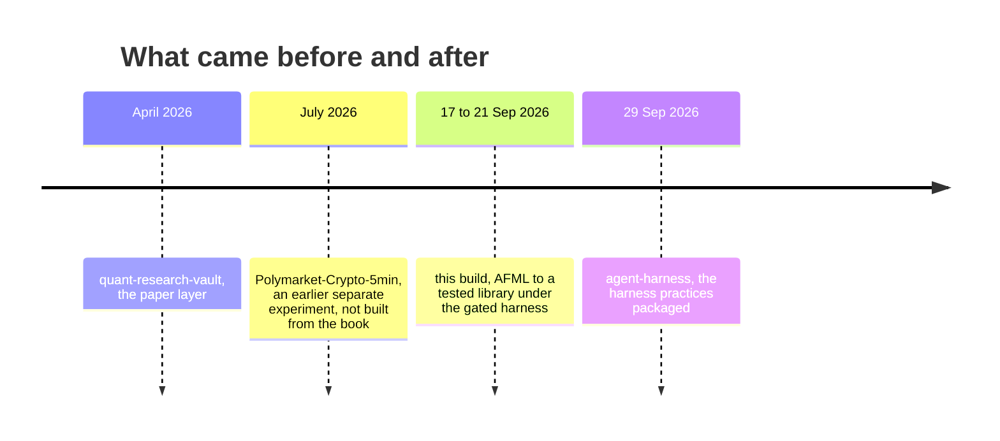

# How the system works

Oscar's AI quant research system has three parts: a vault that acts as its second brain, a harness that decides when
work counts as done, and AI coding agents that do the reading, building and reviewing. This page describes the one
build that ran it from end to end: *Advances in Financial Machine Learning* (AFML) turned into a tested library in five
days, 17 to 21 September 2026. The system was a set of local sessions and is no longer running; what remains is
this record, the library and its tests.

## The vault: a second brain with three layers

| layer | holds | in this build | where |
|---|---|---|---|
| Book | the book's claims, paraphrased, one row each, with section, code location, test and status | written by reader agents, read by builder and auditor agents | [claims/](claims/README.md), 1,805 rows |
| Papers | arXiv and OpenAlex papers, summarised and searchable | not queried: it is a separate pipeline built in April 2026 | [quant-research-vault](https://github.com/oscar-chw/quant-research-vault) |
| Results | what a study measured, and whether the book held on this market | written back as notes on the claims they settle, and as study reports | claim notes; the reports stay private |

The book layer is plain Markdown tables in git, not a note-taking app: an agent reads it with the same tools it
uses for code, and a script checks it. The results layer is how measurement flows back. For example, claim I7.25
(sequential bootstrap) was implemented, measured on one day of about 3,000 label spans, found to raise sample
uniqueness only from 0.205 to 0.212, and recorded as not applicable with those numbers
([claims/ch07.md](claims/ch07.md)).

Where in the code: `docs/claims/chNN.md`, `docs/claims/audit/chNN.md`, `scripts/claims.py`.

## The harness: a gated work graph

Work lived in `plan/<slug>.md` files, one node per line with a gate: a shell command, usually a pytest run, whose exit
code is the only definition of done. There is no failed state. A failed gate appends its evidence and returns the
node to pending, which makes debugging and re-testing one loop. Nodes can depend on other nodes, and a node being
worked on is marked leased. The [rules file](harness-rules.md) every session loaded puts it in one line: "The gate is
the evidence." The same practices were later packaged as [agent-harness](https://github.com/oscar-chw/agent-harness).

Where in the code: `plan/*.md` (the sanitized copy), `scripts/plan_stats.py`, [harness-rules.md](harness-rules.md).

The graph also enforces the book's own order. AFML argues that research comes before backtesting and that a backtest
must never feed back into the model. In `plan/afml-pipeline.md`, feature importance is node 3 and backtests are node 6.
`tests/test_afml_backtest_discipline.py` reads that graph and fails if node 6 is an ancestor of any research stage, or
if a node is marked done while one of its dependencies is open.

## The agents

One Claude Code session orchestrated the build. It read the plan, wrote briefs, and sent work to subagents: builders,
code reviewers and security auditors (approximate counts are on [the evidence page](evidence.md#b-orchestration)).
Each subagent had one job; three of the task titles in the private session logs are "Adversarial audit AFML
ch1/ch2/ch3", "Line review: AFML library (node 9)" and "Bet-sizing infrastructure by the book (node 12)". The gate run
recorded under each node, not the subagent's report, is what marked it done.

Where in the code: the briefs and transcripts are private; their results are `src/pmlab/afml/`, `tests/` and
the gate runs in `plan/*.md`.

Oscar set the goals and the constraints, and some node titles keep his words, for example node 17 of
`plan/afml-pipeline.md`: "make sure the dev is correctly implemented chapter sub chapter sub chapter by one by one".
He reviewed the results. The agents wrote the claims, the code, the tests and the reviews.

## Where this sits among the other repositories

[Polymarket-Crypto-5min](https://github.com/oscar-chw/Polymarket-Crypto-5min) is an earlier, separate experiment
(July 2026), not built from the book.
