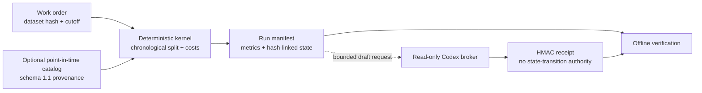

> Package reference. Start at the [root README](../../README.md); the [docs index](../../docs/README.md) has reading paths.

# QRAE-RD: reproducible quantitative research

`qrae` is a local-first kernel for reproducible quantitative-research experiments with explicit provenance and human authority gates. Its working slice takes a registered price-series hypothesis through data checks, a delayed-fill baseline, accounting review and an immutable report bundle.

The practical problem is research handoff: a teammate reviewing a promising backtest needs the exact data, timing assumptions, costs, split policy and evidence behind each claim. QRAE records those inputs together and makes replay and rejection inspectable. It is the research/evidence package consumed by the QuantOS application. The supported installed workflow connects synthetic collector data, coverage-aware replay and catalog-bound experiments to a source-linked report. Team dashboards, real-data/model qualification and live execution remain separate work.

Start with the offline demo below, then use the [implementation walkthrough](docs/portfolio-architecture.md) for the source map, quant decisions and missing interfaces.

## Status & honesty

Active research harness. **No headline performance result; the deliverable is the harness.** The public fixture is synthetic, its work order caps evidence at `E0` (the lowest evidence tier: software behaviour only, no empirical claim), and no in-sample, out-of-sample, profitability, or alpha result is claimed. The offline demo checks manifest replay, artifact verification and rejection of a tampered copy; these checks establish software behavior, not investment performance.

## Architecture

- A hash-bound work order identifies the dataset, point-in-time cutoff, registered costs, split policy, and evidence ceiling.
- `DataCatalog` freezes normalized inputs and manifest evidence as immutable SHA-256-addressed objects; point-in-time snapshot resolution requires an `as_of` time.
- The local kernel runs a chronological lagged baseline, recomputes metrics from its persisted return series, and independently reconstructs positions, delayed-fill returns and split-local costs from the frozen prices using rational arithmetic. It appends hash-linked state and claim artifacts. This internal reference check does not establish external replication or realistic execution.
- The optional Codex broker accepts a bounded read-only task, then HMAC-signs a result receipt using a key stored outside the workspace; ingestion cannot change metrics, research state, capital, or execution authority.



## The interesting decision

Provenance and temporal availability are executable gates rather than report annotations: a run is refused when its hashes, point-in-time contract, evidence ceiling, or authority boundary do not validate. This makes replay and review mechanically checkable; the tradeoff is additional manifests, immutable artifacts, and deliberate refusal to promote observed-at-import or public-metadata inputs beyond `E0`.

## Provenance

The implementation in `src/qrae/` and the synthetic fixture are maintained in this repository. The requirements use **RD-Agent-style** research/development feedback and score terminology, but the tree contains no vendored `microsoft/RD-Agent` source and does not depend on that package. The bounded metadata adapter targets Polymarket's public Gamma API and explicitly records its terms as unverified. The code is MIT licensed with the rest of the repository ([LICENSE](../../LICENSE)); that licence does not extend to Polymarket's data.

## Five-minute offline demo

From the monorepo root, with Python 3.10+ (tested on macOS with Python 3.11):

Check `python3 --version` first. If it points to macOS Python 3.9, use your Python 3.11 executable in these commands and when creating the development environment.

```bash
python3 packages/research/scripts/portfolio_demo.py
# Retain the run bundle in a NEW directory:
python3 packages/research/scripts/portfolio_demo.py --output ./demo-artifacts
```

No package installation, network connection, model, account or private dataset is needed for this demo. It copies the committed synthetic fixture into a disposable workspace, runs the existing kernel twice, verifies that the manifest is identical, and rejects a tampered copy. The original verified bundle is retained when `--output` is supplied. Existing output directories are refused.

Expected fields: `status: HUMAN_REVIEW`, `evidence_tier: E0`, `idempotent_replay: true`, `tamper_rejected: true`, `live_trading_authorized: false`. The manifest hash and run path are generated artifacts, not fixed headline metrics.

This demo uses work-order schema `1.0`, so it exercises the direct CSV path. Catalog import/binding and optional model review have separate tests; the demo does not exercise them or the legacy web surface.

## Local synthetic catalog intake

[synthetic_import.py](src/qrae/synthetic_import.py) provides `import_synthetic_prices(catalog, csv_path, derivation, observed)` for prices derived locally from a synthetic collector fixture. It returns the usual snapshot record for a schema `1.1` work order. The import records a `LOCAL_SYNTHETIC/none` adapter with no hosts, `OBSERVED_AT_IMPORT`, and E0. Its `urn:qrae:synthetic:<sha256>` identity hashes the canonical derivation manifest; it makes no HTTPS-origin claim.

The derivation contains exactly `schema_version: qrae.synthetic-derivation.v1`, `synthetic: true`, `market_family`, `generator_sha256`, finite-JSON `parameters`, `collector_raw_sha256`, `collector_normalized_sha256`, and `normalized_price_sha256`. The helper checks the CSV hash and exact price columns and requires the fixture's event and availability times to agree. Generator and collector hashes are recorded declarations; the caller must verify the corresponding source artifacts. `observed` is a UTC datetime marking local import, not historical market availability.

The synthetic adapter and portable provenance envelope use schema `1.1`; existing HTTPS adapters/envelopes remain `1.0`. The catalog freezes the derivation alongside normalized-price bindings so a completed run remains verifiable after removing the source catalog. See [focused import tests](tests/test_synthetic_import.py) for the complete work-order example and rejection cases. The baseline kernel and price schema are unchanged.

## Find the implementation

| Question | Start here | Practical role |
|---|---|---|
| How do I run or verify research? | [cli.py](src/qrae/cli.py), [kernel.py](src/qrae/kernel.py) | Connect the registered experiment to a reviewable result |
| What exactly is permitted in a run? | [contracts.py](src/qrae/contracts.py), [example work order](examples/price_baseline/work_order.json) | Fix the hypothesis, data hash, time cutoff, split and costs before execution |
| Where do prices and provenance enter? | [data_catalog.py](src/qrae/data_catalog.py), [price_import.py](src/qrae/price_import.py), [historical_data.py](src/qrae/historical_data.py), [synthetic_import.py](src/qrae/synthetic_import.py) | Preserve observations and revision evidence; distinguish local synthetic derivation from HTTPS-source imports |
| How are positions, costs and returns calculated? | [price_baseline.py](src/qrae/price_baseline.py) | Delay fills, charge turnover and make chronological accounting explicit |
| What makes an old run reviewable? | [artifacts.py](src/qrae/artifacts.py), [state.py](src/qrae/state.py) | Keep write-once artifacts and detect inconsistent state or changed bytes |
| Where can a model help? | [research_workflow.py](src/qrae/research_workflow.py), [codex_broker.py](src/qrae/codex_broker.py), [codex_reviews.py](src/qrae/codex_reviews.py) | Produce bounded drafts tied to evidence without promoting research state |
| What does the browser show? | `public/index.html` (history only), `api/research/latest.js` (history only) | Existing legacy review snapshots; no connection to newly generated local runs |
| Which behaviors are checked? | [tests/](tests/) | Inspect success, rejection, replay and non-promotion cases |

`src/qrae/` is one installable Python package. `scripts/` contains the portfolio demo; the former `configs/` runtime/requirement declarations and `research_base/latest/` legacy examples are history only, and generated kernel bundles belong under the chosen output root. No package move is needed to follow this distinction.

## Engineering walkthrough

1. Inspect `examples/price_baseline/work_order.json`: dataset hash, availability cutoff, chronological split, lagged momentum and registered 5 bps costs.
2. Follow `src/qrae/kernel.py` into the price baseline and artifact validator. The signal uses prices through `t`, fills at `t+1`, and earns the `t+1` to `t+2` return. Each split starts and ends flat and charges those trades.
3. Open the generated `result.json`, `validation.json` and `decision.json`: explain what is reproducible and what the synthetic fixture cannot establish.
4. Discuss limitations: bar-level fills, simplified costs, no queue position, liquidity or capacity validation, and no evidence of investable alpha.

## Development checks

From the monorepo root (`scripts/env.sh` selects `.venv/bin/python` or `$PYTHON` and sets `PYTHONPATH`; no install needed):

```bash
source scripts/env.sh
$PY -m pytest -q -p no:cacheprovider packages/research/tests
$PY -m ruff check packages/research
```

Ruff, Ruff formatting and Pyright come from the package's `dev` extra and are not part of the root `make check`; Windows execution of these scripts is untested. Tests use disposable receipt-key stores outside their test workspaces; no developer-profile keys are needed. This is test isolation, not a relaxation of the broker's outside-workspace rule.

`bash scripts/check.sh` from the repository root runs this package's suite (`packages/research/tests`) with the others and prints its count. These are local results, not hosted-CI evidence.

## Contribution context

This repository was published with fresh history; earlier history is not public ([design history](../../docs/design-history.md#publication-history)). WorldQuant BRAIN work and competition projects are separate and not in this package.

## Limitations

The repository contains no licensed historical dataset or validated alpha record. Manifest validation can prove internal consistency but not legal entitlement or external authenticity. Provider-specific automated historical adapters, walk-forward model selection, portfolio and risk engines, paper execution, and live execution remain incomplete; no LLM output can authorize any of them.

The portfolio now has a bounded synthetic collector-to-price application, and the kernel includes a price-to-position replay oracle. The next useful interfaces are general availability-aware data admission and a verified run export for team analysis and visualization. Their smallest useful scope and acceptance checks are described in the [implementation walkthrough](docs/portfolio-architecture.md#next-interfaces).
