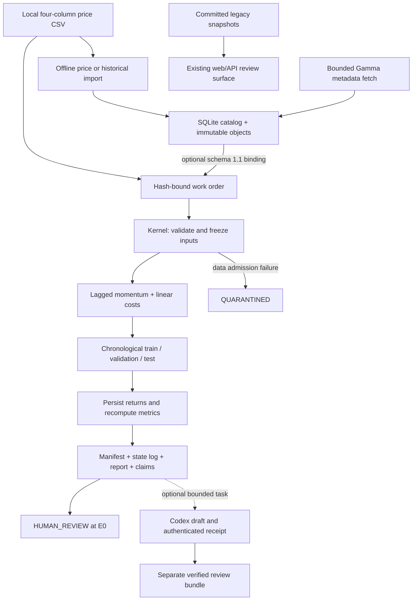

> Package reference. Start at the [root README](../../../README.md).

# QRAE implementation walkthrough

QRAE addresses a practical quant-research problem: making a backtest reviewable after the original researcher, notebook session or model response is gone. The current executable unit is one registered lagged-momentum baseline on a frozen price CSV. It produces reproducible accounting and an evidence bundle for human review. A connected market-data, feature, research and team-analysis platform remains a development target.

This map describes the inspected implementation. The broader [architecture](ARCHITECTURE.md) includes explicitly planned planes; the [local kernel reference](LOCAL_KERNEL.md) documents detailed contracts and commands.

## Current data flow



The Gamma adapter stores market metadata, not a historical price series for the baseline. The web surface reads committed examples rather than the kernel's output directory. These are separate paths in the current implementation, not steps already connected by the diagram.

## One experiment, step by step

1. **Register the question.** [contracts.py](../src/qrae/contracts.py) parses an expiring research-only `WorkOrder`: falsifiable hypothesis, dataset SHA-256, cutoff, split fractions, minimum test observations, momentum lookback and cost in basis points. Only `PRICE_BASELINE`, `lagged_momentum` and evidence ceiling `E0` are accepted. There is no feature/model plug-in registry.
2. **Freeze the input.** [kernel.py](../src/qrae/kernel.py) rehashes and copies the CSV before running. Schema `1.0` uses the local file directly; schema `1.1` also resolves a [catalog](../src/qrae/data_catalog.py) snapshot as of the work-order cutoff and freezes its portable provenance envelope. A completed catalog-bound run can be verified without the source catalog.
3. **Admit the data.** [price_baseline.py](../src/qrae/price_baseline.py) checks required columns, timezone-aware timestamps, availability, cutoff, duplicates, per-instrument order and finite positive prices. Multiple instruments must share the same event-time grid. The current rule requires `available_time <= event_time`; it does not model late-arriving bars with a separate later decision clock.
4. **Calculate the baseline.** The signal at `t` is the sign of `price[t] / price[t-lookback] - 1`. It fills at `t+1` and earns the price return from `t+1` to `t+2`. Instruments are equal weighted. Costs equal `cost_bps / 10,000` times absolute position change. Every split starts and ends flat, including entry and liquidation costs.
5. **Review accounting.** The kernel serializes the return series, then separately parses it and recomputes split accounting, return statistics and drawdown. This catches metrics that disagree with the persisted series. It also uses [price_reference.py](../src/qrae/price_reference.py), an independently parsed rational-arithmetic reference, to reconstruct lagged positions, delayed holding returns, turnover and split entry/liquidation from frozen prices. New validation receipts use schema `1.1`; valid historical `1.0` receipts retain their bytes and are checked with the reference on fresh verification. The validator explicitly records `external_independent_reproduction: false`.
6. **Keep the evidence and stop.** [artifacts.py](../src/qrae/artifacts.py) stores write-once objects and hash/size manifests; [state.py](../src/qrae/state.py) records legal transitions in a hash-linked JSONL log. The result includes a claim ledger and report. Successful mechanics stop at `HUMAN_REVIEW`, with `REVISE` proposed at `E0`; data-quality failures can terminate at `QUARANTINED`. Invalid work orders fail before a research run is admitted.

## Quant and engineering choices

| Choice | Why it matters in research | Current boundary |
|---|---|---|
| Explicit event and availability times | A price is usable only when known; timestamp policy can create or remove apparent predictability | Strict availability admission, without a general late-data/as-of join engine |
| Delayed fill and turnover costs | Separate information formation from simulated execution and expose trading-frequency costs | Bar-level execution, linear costs; no spread, queue, impact, funding, borrow or settlement model |
| Chronological splits with flat boundaries | Preserve time order and account for the trades needed to start/end each evaluation segment | One registered split; no WFO, parameter-selection policy or multiple-testing correction |
| Decimal return arithmetic, explicit metric units | Make price/position accounting reproducible and avoid calling a per-observation ratio annualized Sharpe | Float serialization and statistic calculations; no claim of universal exact arithmetic |
| SQLite metadata plus SHA-256 objects | Query provenance while keeping exact input bytes independently verifiable | Local file storage; no distributed catalog, throughput benchmark or feature materialization layer |
| Hash-linked state and write-once artifacts | Detect changes and make retries refer to a specific experiment | Internal integrity is not proof of market-data authenticity, legal rights or research validity |
| Bounded draft broker | Let a model critique or explain artifacts without becoming a metric/approval source | Receipt authenticates local broker issuance, not model identity or analytical truth |

For a small price-series baseline, the standard-library implementation makes the formulas and failure paths inspectable without a dataframe or orchestration dependency. Performance and larger-scale data representations should be chosen from a measured workload; no speedup is claimed here.

## Package and file map

| Area | Files | Read for |
|---|---|---|
| User entry points | [cli.py](../src/qrae/cli.py), [portfolio_demo.py](../scripts/portfolio_demo.py), `qrae_run_cycle.py` (history only) | Installed `qrae` command, disposable demo and local compatibility wrapper |
| Research contract/execution | [contracts.py](../src/qrae/contracts.py), [kernel.py](../src/qrae/kernel.py), [price_baseline.py](../src/qrae/price_baseline.py) | Experiment identity, orchestration, price-to-return semantics and verification |
| Data admission | [data_catalog.py](../src/qrae/data_catalog.py), [price_import.py](../src/qrae/price_import.py), [historical_data.py](../src/qrae/historical_data.py), [polymarket.py](../src/qrae/polymarket.py) | Catalog resolution, existing-CSV import, source-manifest/revision evidence and bounded metadata fetch |
| Evidence storage | [artifacts.py](../src/qrae/artifacts.py), [state.py](../src/qrae/state.py), [path_safety.py](../src/qrae/path_safety.py) | Immutable publication, state commitments and filesystem boundaries |
| Optional drafting | [research_workflow.py](../src/qrae/research_workflow.py), [codex_broker.py](../src/qrae/codex_broker.py), [codex_reviews.py](../src/qrae/codex_reviews.py) | Work-order/result binding, receipts, recovery and separate review ingestion |
| Review/requirements facade | `public/` (history only), `api/` (history only), `configs/` (history only) | Existing web contracts and declared capability/gate metadata |
| Samples and history | [examples/](../examples/), `research_base/latest/` (history only), `qrae_run_full_v0.py` (history only) | Synthetic price inputs and older hard-coded tournament examples; these are not new research evidence |
| Verification | [tests/](../tests/), `check_web_contract.js` (history only), `qrae_traceability_audit.py` (history only) | Behavioral checks, disabled web execution and requirement-to-source traceability |

`pyproject.toml` packages only `src/qrae/` and installs `qrae = qrae.cli:main`. The separate Node package (history only) had no package dependencies and checked the web contract. It did not install or run the Python research kernel. The current file layout is retained so existing imports and wrappers remain intact.

## Offline evidence a reviewer can inspect

From the monorepo root, with `python3` resolving to Python 3.10+ (or substitute your Python 3.11 executable):

```bash
python3 packages/research/scripts/portfolio_demo.py
# Use a directory that does not already exist to retain the evidence:
python3 packages/research/scripts/portfolio_demo.py --output ./demo-artifacts
```

The no-output form verifies and removes a temporary bundle. The retained form writes `demo-summary.json` with the actual `run_dir`; open that directory to follow these artifacts:

| Artifact | Reviewer question |
|---|---|
| `work_order.json`, `snapshot/prices.csv` | Which hypothesis, parameters and exact input bytes generated the experiment? |
| `backtest/series.jsonl`, `result.json` | Do accounting, costs and metric units match the declared strategy/splits? |
| `validation.json` | Which checks actually ran, and what did the validator not establish? |
| `decision.json`, `claim_ledger.json`, `report.md` | Which statements are mechanical results, hypotheses or unsupported claims? |
| `state.jsonl`, `manifest.json` | Which transitions and artifacts belong to the same immutable run? |

The demo checks identical-input manifest replay and rejection of a tampered copy. It does not import a catalog snapshot, invoke Codex, connect another repository or run the web surface. For the separate behavioral coverage, inspect [test_catalog_kernel_binding.py](../tests/test_catalog_kernel_binding.py), [test_price_import.py](../tests/test_price_import.py), [test_price_baseline.py](../tests/test_price_baseline.py), [test_kernel.py](../tests/test_kernel.py) and [test_research_workflow.py](../tests/test_research_workflow.py). The 2026-09-12 portfolio baseline recorded 233 passing tests; this documentation pass does not renew that full-suite result.

## Next interfaces

Status is stated per interface; remaining generalization and UI work are proposed:

Connect the data adapter and team review export first. Keep the current validation boundary explicit while planning the bounded semantic replay check; it does not require a broad simulator rewrite.

1. **Collector snapshot to QRAE experiment — bounded synthetic integration exists in the portfolio application.** Generalize the existing deterministic adapter from a fixed synthetic collector fixture to `qrae.price-bars.v1`, preserving source hashes, timestamp meaning, instrument identity and a declared price rule. Bind the import to a schema `1.1` work order and demonstrate rejection of future/unavailable inputs. Keep observed-at-import provenance at `E0`. A metadata quote must not silently become a tradable fill or a historical availability claim.
2. **Frozen prices to semantic replay — implemented on September 14.** Internally consistent wrong returns and doubled costs previously passed verification; the kernel now rejects them before manifest/latest publication. [Reference tests](../tests/test_price_reference.py) include hand-calculated two-instrument long/short/flat positions, single-point splits, seeded reversals, malformed timing and legacy receipt compatibility. The existing accounting validator and E0 ceiling remain. This reference qualifies only the registered baseline, not arbitrary strategies or executable fills.
3. **Verified run to team analysis.** Define a versioned, allowlisted read-only export containing run/manifest identity, quality/validation status, split returns, drawdown, turnover/costs, claims and limitations. Feed a local review view from that export; show missing, stale, quarantined and changed evidence explicitly. Start with one-run drilldown and two-run comparison. The legacy dashboard must not label a committed snapshot as a fresh run.

After this connected baseline is reviewable, a feature/strategy interface and WFO can support a broader research loop. Portfolio risk and realistic execution require their own contracts and evidence. Documentation, an LLM draft or an `E0` run does not complete those gates.

## Contribution and limits

This package covers experiment and provenance engineering, temporal and accounting checks, durable evidence and bounded model-assisted review. It claims no validated alpha and no production execution. The source uses RD-Agent-style terminology but has no vendored RD-Agent dependency.
