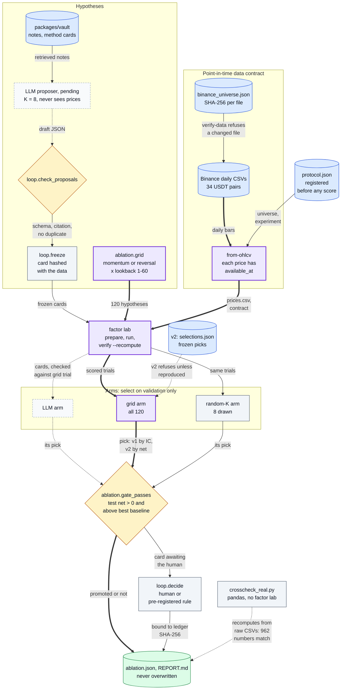
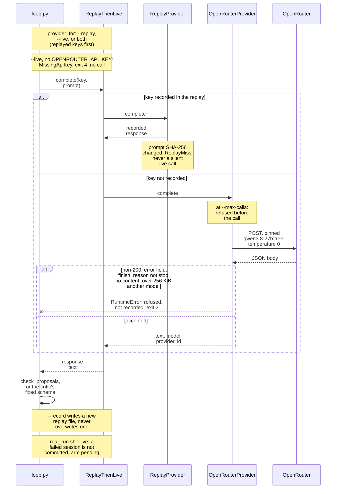

# asof-research: can an LLM pick better trading hypotheses than brute force?

[](https://github.com/oscar-chw/agentic-quant-research/actions/workflows/platform.yml) [](https://github.com/oscar-chw/agentic-quant-research/actions/workflows/platform-lint.yml)

A point-in-time ("as-of") research harness, for quant researchers and anyone reviewing LLM-driven research, that tests an LLM's
trading hypotheses without trusting it: every hypothesis is frozen before it is scored, code the model never touches computes
every number, and the LLM must beat two dumb controls (all 120 hypotheses, or 8 drawn at random) under one pre-registered gate.
On REAL Binance data (34 pairs, selected on 2024, tested 2025-01 → 2026-08, 10 bps a side) the gate blocked both control picks,
which lost 6.9 and 7.4 bps/day out of sample; the LLM arm is pending until its forward window closes on 2027-08-31.

How it fits together: prices enter through a checksummed point-in-time contract, hypotheses are frozen before they are
scored, every arm selects on validation only, and one gate decides (purple marks the path the study is about).



Where in the code: `apps/quantos/src/quantos_showcase/{ablation,loop}.py`, `packages/factor/src/factor_research/`, `packages/vault/method_contract.py`, `scripts/` (function-level map in [diagrams.md](docs/diagrams.md#1-system-overview-the-harness)).

## Why this exists

An LLM can write a plausible trading hypothesis and explain away any backtest. Its
output is worthless unless something outside the model controls
**what data the test could see**, **when the rule was fixed** and **who may write
numbers**. A fourth question is usually skipped: **does the LLM beat a dumb search?**
If enumerating every hypothesis, or drawing a few at random, selects as well, the LLM
adds cost and no evidence. Here code checks the first three where it can, and the
fourth is an experiment with frozen controls.

## Approach

**The research loop** ([loop.py](apps/quantos/src/quantos_showcase/loop.py); walked through in [how a hypothesis dies](docs/how-a-hypothesis-dies.md)):

| Stage | What happens | The LLM can |
|---|---|---|
| propose | K hypotheses from retrieved vault notes, recorded before any price exists | draft; it never sees prices |
| validate | Drop bad schema, unretrieved citations, duplicates | nothing |
| freeze | A [method card](packages/vault/method_contract.py) fixes signal, lookback, cost, splits and rule, hashed with the data | nothing |
| test | The [factor lab](packages/factor/README.md) runs and recomputes on the prices **without the test rows**; the rule reads validation | nothing |
| critique | A critic sees validation evidence, through a fixed schema | object; a metric field quarantines it |
| gate | Only a card that passed the rule and the critic gets a **test number**; a human or a pre-registered rule decides | nothing |

**The test** ([evaluator.py](packages/factor/src/factor_research/evaluator.py)) is delay 1: signal `P(t-1)/P(t-1-L) - 1`
(reversal is its negative), entry at the close of t, unit-gross rank weights. Net is a daily-rebalanced book at 10 bps per side.

**The race** ([ablation.py](apps/quantos/src/quantos_showcase/ablation.py)): every (signal, lookback) runs once through the
factor lab. The three arms choose from the same scored trials (the LLM's frozen cards, the whole grid, or a seeded random K),
select on validation, and get one look at test.

**The LLM transport** is the only path by which a model's text enters: recorded keys replay, unrecorded keys reach the
pinned open-weight model within a call budget, and any doubtful answer is refused.



Where in the code: `packages/research/src/qrae/llm.py`, `apps/quantos/src/quantos_showcase/loop.py` (`provider_for`); all eight diagrams: [docs/diagrams.md](docs/diagrams.md).

### Design decisions and trade-offs

- **A critic that cannot promote**: it can only object. Costs false negatives, never false positives.
- **Frozen method cards**, hashed with the data before evaluation: any tweak is a new trial.
- **Test sealed until the gate, in code**: a card that stops earlier never gets a test number. Survivors run twice.
- **Controls frozen before the LLM runs**: v2's grid and random-K picks cannot adapt later.

Full reasoning, including which seal applies where: [design-decisions.md](docs/design-decisions.md).

## Results

Protocol v1, REAL data: 34 Binance USDT pairs, daily, checksummed in [binance_universe.json](fixtures/binance_universe.json)
and **survivorship-biased**; grid = momentum or reversal × lookback 1–60; validation 2024, test 2025-01-01 → 2026-08-31;
gate: test net > 0 and above the best baseline. Registered before the first run ([protocol.json](results/real-2026-10/protocol.json)).

| What was measured | Result | Evidence |
|---|---|---|
| Grid arm, all 120: validation pick reversal-40 | test net −6.89 bps/day, test t −0.20 (validation t 2.01); not promoted | [ablation.json](results/real-2026-10/ablation.json) |
| Random-K arm, 8 drawn: pick reversal-48 | test net −7.38 bps/day, test t −0.26; not promoted | [ablation.json](results/real-2026-10/ablation.json) |
| 10,000 further random-K draws | the pick's test net was positive in 0.12% | [ablation.json](results/real-2026-10/ablation.json) |
| Fixed baselines (not selected) | 20-day momentum +0.59, 1-day reversal −15.32, equal-weight hold −3.92 bps/day | [ablation.json](results/real-2026-10/ablation.json) |
| LLM arm | not run in v1 (no model call, none faked); pending in protocol v2 on a forward window to 2027-08-31 | [v2 README](results/forward-2026-09/README.md) |
| Independent recomputation (pandas, no factor lab) | all 962 reported numbers match, largest difference below 1e-15 | [study README](results/real-2026-10/README.md), [crosscheck_real.py](scripts/crosscheck_real.py) |
| Momentum lookback ranking, 2024 net vs test net (POST-HOC) | Spearman −0.59: largely reversed | [selection.json](docs/evidence/selection.json) |

**Disclosed:** the author's alpha-gp-lab repository had already evaluated v1's test window, and v1 gave the LLM a stricter
gate than the controls ([disclosures](results/real-2026-10/README.md#disclosures)). [Protocol v2](results/forward-2026-09/README.md) fixes both
with one rule for every arm and a forward test window; it also selects on net and has frozen the controls' picks.


<sub>Why selection failed (POST-HOC, not pre-registered): the five best momentum lookbacks on 2024 net are all negative on
test ([selection.json](docs/evidence/selection.json)).</sub>

**What the LLM must do to win.** Every hypothesis is already scored, so any 8 cards land between −15.32 and +3.79 bps/day;
30 of the 113 possible picks pass the gate ([posthoc.json](results/real-2026-10/posthoc.json)).

## Quick start

```sh
cd platform                                 # in a clone of agentic-quant-research; every command runs here
python3.11 -m venv .venv && .venv/bin/pip install -r requirements.txt
bash scripts/demo.sh                        # offline, seconds: the loop on SYNTHETIC panels, then the v1 table
bash scripts/check.sh                       # every suite (it prints each count), C++ if clang++ exists, the demo
python3 tools/render_selection.py --check   # recompute the figure's numbers from the committed results
# with the CSVs from scripts/fetch_binance_daily.py (network):
ASOF_DATA_DIR=<dir> bash scripts/demo.sh    # verifies their checksums, recomputes every number with pandas
ASOF_DATA_DIR=<dir> bash scripts/real_run.sh  # reruns the study
```

The demo walks five hand-written hypotheses to [four different deaths](docs/how-a-hypothesis-dies.md), then prints the committed v1 table.

## Project structure

```
apps/quantos/         the research loop (loop.py) and the LLM-vs-grid-vs-random race (ablation.py)
packages/factor/      the factor lab: point-in-time panels, rank IC, costs
packages/vault/       paper notes, retrieval, method cards
packages/research/    the LLM transport and the critic broker
packages/marketdata/  order-book replay and an opt-in C++20 port (separate from the study)
packages/imc-sim/     IMC Prosperity 4 post-competition analysis (separate from the study)
results/              the registered studies: real-2026-10 (v1) and forward-2026-09 (v2, pending)
fixtures/             the checksummed Binance universe
scripts/              demo, check, data fetch, study run and the pandas cross-check
tools/                the figure and the run-summary envelope validator
tests/                repository-level tests: docs and registered-file digests, data fetch, study script, figure
docs/                 explanations and evidence pages
```

Docs: see [docs/README.md](docs/README.md); package names and owners in [architecture.md](docs/architecture.md).

## Limits

- **No model has run the loop.** Every LLM response here is hand-written; the live path is tested only with fakes.
- **One market, one used window, a biased universe**: 34 surviving Binance pairs over 20 months that another analysis had already seen.
- **Idealized execution**: trades at the daily close, a flat 10 bps, fractional positions, and no slippage, borrow or funding.
- **A narrow space**: momentum or reversal with a lookback; five hand-written notes; retrieval unevaluated.
- **Low power, stated in advance**: in v2 one arm breaks even at about 8.7 bps/day of test net, with about a 15% chance of detecting the frozen grid pick's own validation edge, 3.21 bps/day ([power.json](results/forward-2026-09/power.json)).
- **Registration times are the author's record.** The development history is private, so git order cannot show them; SHA-256 digests show the registered files are unchanged ([publication history](docs/design-history.md#publication-history)).

## What I learned

- **A validation winner among 120 related tries can vanish out of sample.** The
  grid's pick had validation t = 2.01 (Newey-West 2.13) and test t = −0.20. Source:
  [ablation.json](results/real-2026-10/ablation.json), [posthoc.json](results/real-2026-10/posthoc.json).
- **The selection metric and the gate metric can disagree.** 36 of 60 momentum
  lookbacks had negative validation IC and positive validation net, in one
  window. Source: [posthoc.json](results/real-2026-10/posthoc.json).
- **A gate can decide an experiment before it runs.** No hypothesis clears the
  sleeve-cost card rule, so v1's LLM arm could not win. Source:
  [the study README](results/real-2026-10/README.md#disclosures).
- **An LLM transport must carry the whole contract.** The critic's output schema
  reached Codex as a file argument but never reached `claude -p`, the live transport then. Source:
  [llm.py](packages/research/src/qrae/llm.py), [test_llm.py](packages/research/tests/test_llm.py).
- **Correctness, statistical evidence and economic utility are separate gates.**
  Source: [engineering-case-study.md](docs/engineering-case-study.md), recorded lesson.

## Credits and licence

- The envelope validator, which refuses an overclaiming run summary, comes from my
  codex-quant-os, an earlier private project.
- Price data: Binance public spot daily klines (data.binance.vision). The v2 LLM arm's model: the open weights Qwen3.8-27B, served on OpenRouter.
- imc-sim's log parser is written independently from the format of the community [imc-prosperity-4-backtester](https://github.com/nabayansaha/imc-prosperity-4-backtester) at a pinned revision; no upstream code is distributed ([details](packages/imc-sim/docs/UPSTREAM_FORMAT.md)).
- My other real-data result, a negative walk-forward, is [Polymarket-Crypto-5min](https://github.com/oscar-chw/Polymarket-Crypto-5min).
- MIT licensed ([LICENSE](LICENSE)).

Implemented with AI coding agents under Oscar's design and review.
