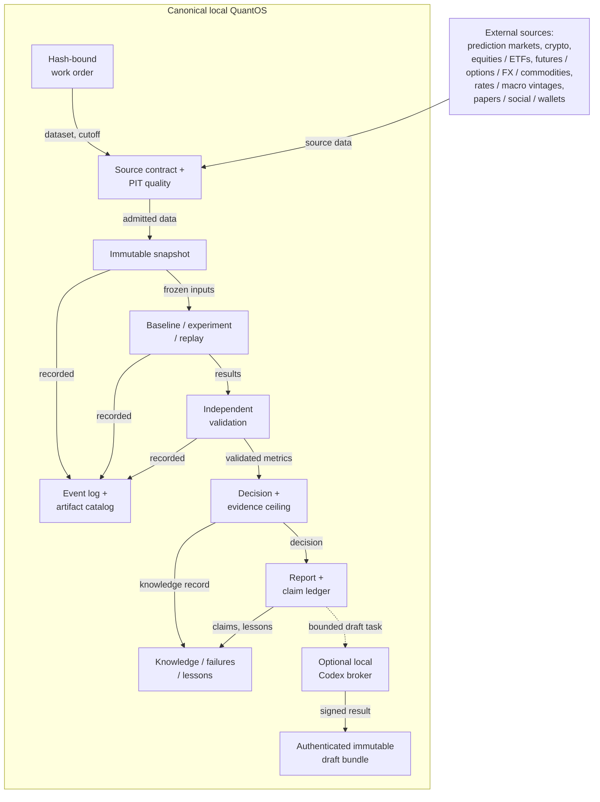
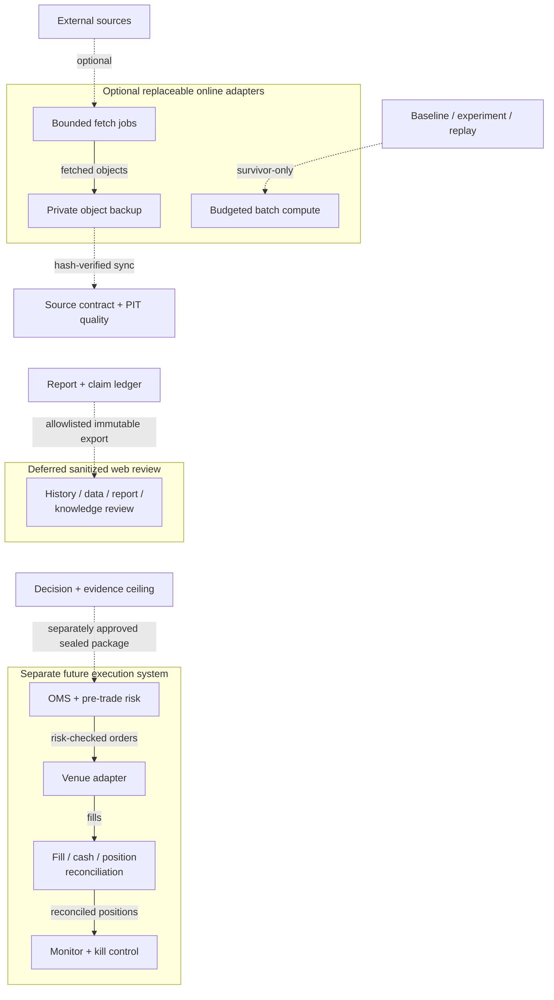

# QRAE QuantOS architecture

## Authority model

QRAE is local-first. Data and immutable artifacts own facts, deterministic validators own promotion gates, and humans own publication, exceptional risk, paper/live activation, credentials, and capital.



Around that core sit optional online adapters, a deferred review export and a separate future execution system; dotted arrows are optional or not yet built:



## Executable local slice

The current kernel implements one generic price-series baseline:

1. validate a relative, hash-bound, expiring, research-only work order;
2. optionally resolve a catalog snapshot as of the work-order cutoff, then copy the hash-matched dataset and freeze its portable provenance envelope;
3. enforce schema, UTC, availability, cutoff, duplicate, monotonicity, and positive-price checks;
4. form a lagged signal using information available at time `t` and apply it only to the next observation;
5. charge registered cost per unit of position change;
6. use disjoint chronological train, validation, and locked test segments;
7. recompute accounting and metrics;
8. create a claim ledger, decision proposal, knowledge record, report, manifest, and hash-chained state log;
9. stop at `HUMAN_REVIEW` or fail closed at `QUARANTINED`.

The catalog slice adds SQLite metadata, immutable content-addressed objects, PIT resolution, provenance hashes, a bounded Polymarket metadata adapter, and a six-family historical importer. Historical imports enforce per-instrument monotonicity and latest-only dataset/provider revision lineage, then freeze exact manifest text, validation/evidence hashes, and validation times in a `LOCAL_MANIFEST_IMPORT` bundle beside normalized prices. They remain E0 because code cannot establish legal truth or downstream temporal validity. Work-order schema `1.1` freezes selected normalized provenance into runs.

## State machine

```text
REGISTERED
-> SOURCE_RESOLVED
-> SNAPSHOT_FROZEN
-> DATA_QUALITY_PASSED | QUARANTINED
-> CHEAP_FALSIFICATION
-> BASELINE_COMPLETE
-> EXPERIMENT_COMPLETE
-> INDEPENDENT_VALIDATION
-> REPORT_READY
-> HUMAN_REVIEW
```

The event log is append-only, canonical JSONL with a SHA-256 chain. Retries are idempotent only when payload and artifact hashes match. The kernel cannot enter paper/live states.

## Codex boundary

The broker supports only `HYPOTHESIS_REVIEW`, `ADVERSARIAL_CRITIC`, and `REPORT_DRAFT`. Work-order v2 binds both the exact input and source run manifest at preparation. Input files and allowed paths are relative, immutable, hash-bound, UTF-8, size-limited, expiry-limited, and scanned for credential patterns. Invocation is local and shell-free; it ignores user config/rules, disables action tools and integrations, uses an isolated read-only permission profile and working directory, validates a strict output schema, and enforces time plus streaming output bounds.

Codex output is draft evidence with `requested_transition=NONE`. Disabled or unavailable Codex yields `DEFERRED_NO_CODEX`; timeout, malformed output, forbidden claims, or runner failure yields `QUARANTINED`. The deterministic pipeline continues without it.

Result schema v2 closes ambiguous terminal combinations. Each result is paired through a recoverable journal with an HMAC receipt whose signed commitment covers the work order, canonical result, source manifest, and exact cited evidence hashes. The key lives outside the workspace. This authenticates local broker issuance, not model identity or research truth; same-user compromise remains outside the boundary.

Only `DRAFT_READY` can enter `codex-reviews/<run>/<task>`. Ingestion verifies the canonical source run and receipt, stages a complete four-file bundle, then atomically publishes the directory. Reverification is offline and outbox-independent but requires the source run and receipt key. The bundle has no metric, state-transition, capital, or trading authority and cannot mutate canonical research state.

`research-draft` commits a canonical invocation covering the run, task, input, Codex flag, lifetime, timeout, and output budget before composing the deterministic run through offline verification. A changed task-ID replay fails. A completed broker pair can recover a missing workflow receipt; an expired prepared-only task yields a typed deterministic successor ID. Only `DRAFT_READY` produces a derived hash-bound Markdown draft.

## Planned planes

1. **Kernel:** extend the initial SQLite catalog with budgets, retries, approvals, and recovery.
2. **Data:** turn the historical manifest foundation into approved provider-specific adapters and prove 14 bounded cycles; then add raw/normalized/feature layers and DuckDB/Polars/Parquet where measured workloads require them.
3. **Research:** hypothesis tournament, cheap falsification, WFO, replay, portfolio construction, independent replication.
4. **Knowledge:** Obsidian-compatible objects, full-text search, typed provenance graph, negative results and lessons.
5. **Model:** simple baselines before regularized, boosted-tree, neural, ensemble, and eventually simulator-gated RL challengers.
6. **Evidence/report:** formula, source, trial, action, decision, and requirement ledgers; LaTeX/PDF and visual/reproduction QA.
7. **Optional online:** replaceable fetch, object backup, and bounded compute; cloud failure cannot erase or promote local state.
8. **Future execution:** physically and procedurally separate from research and LLM processes.
